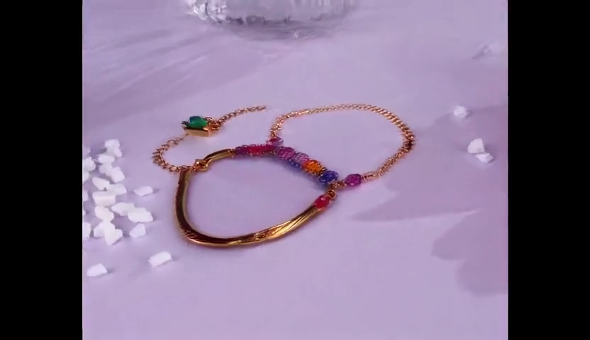
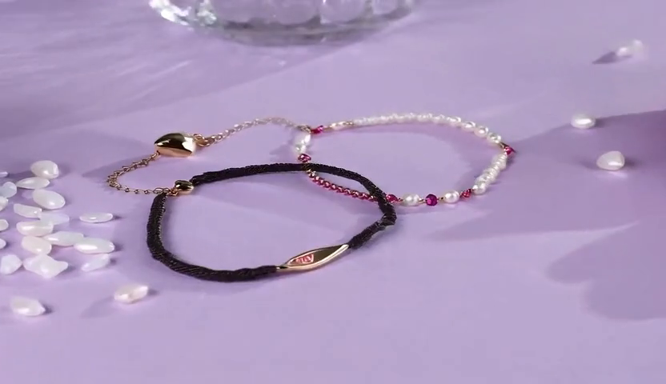
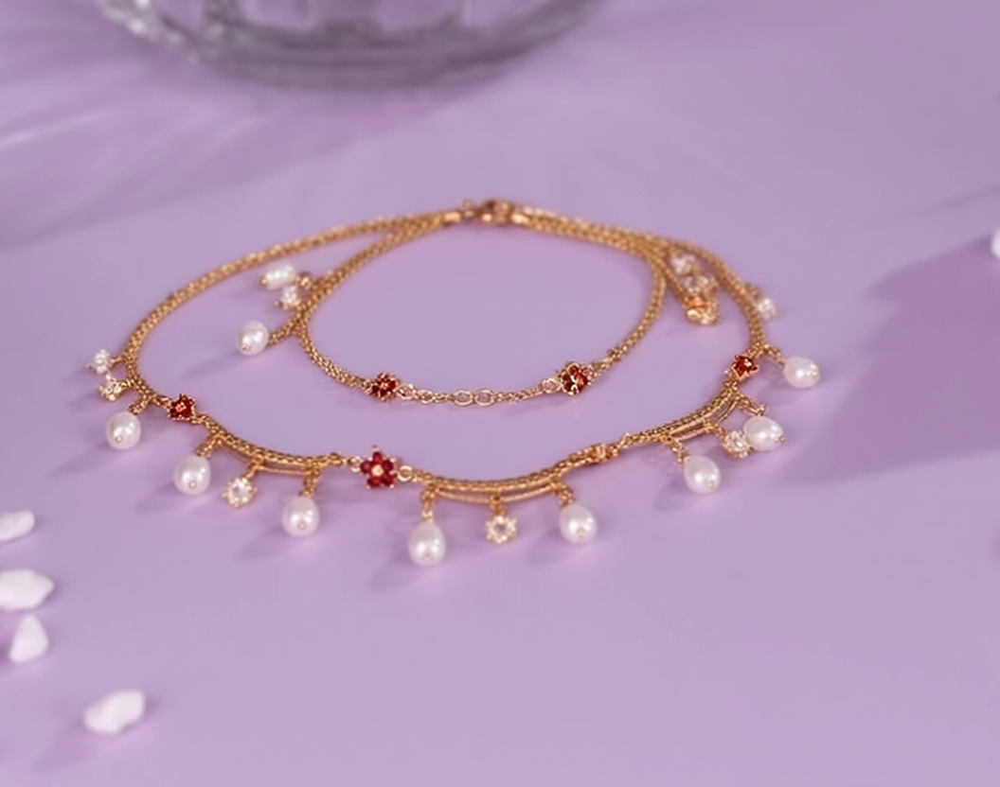
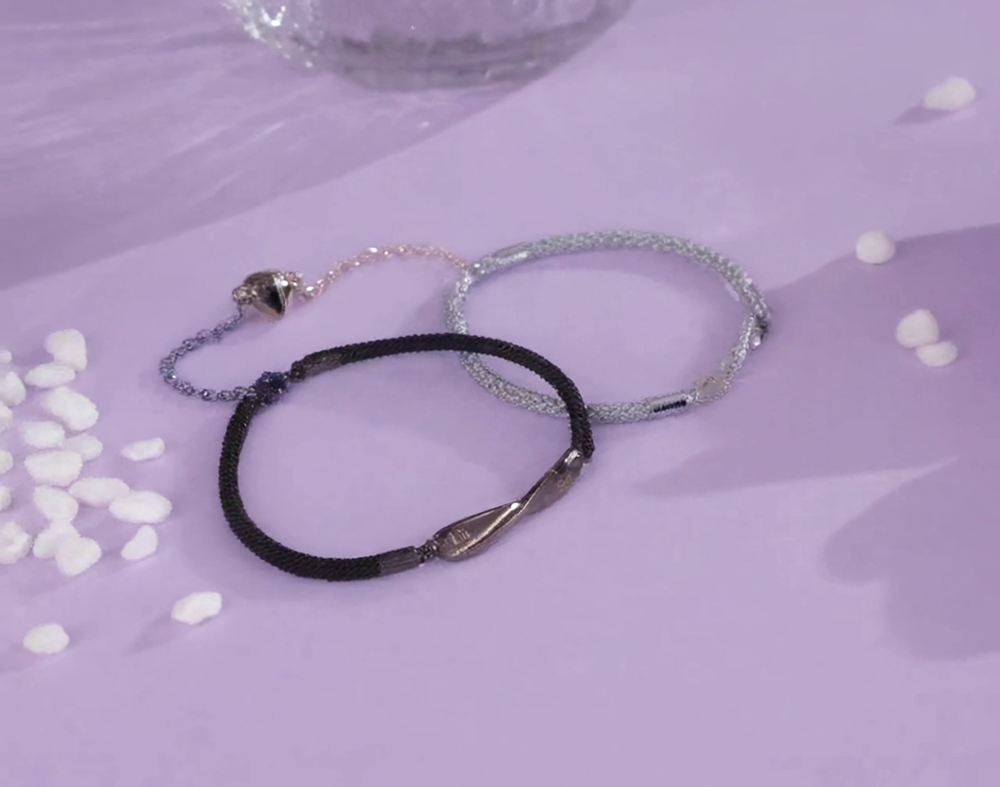

# PVTT 周报 - 2026-01-12

**项目**：Product Video Template Transfer (PVTT)
**当前阶段**：Baseline 开发 & 实验

---

## 本周工作概览

| 日期 | 主要工作 |
|------|----------|
| 01-05 | Baseline 对比实验 (Wan2.1 vs Wan2.2, FlowEdit/FlowAlign/WANAlign) |
| 01-06 | Chrome 插件开发（数据集采集工具） |
| 01-07 | RefDrop 技术设计、Etsy 50样本采集 |
| 01-09 | RefDrop 实验（失败）、组合方法设计 |
| 01-10 | Flux.2 + TI2V 组合方法实验（成功） |
| 01-12 | TI2V + FlowEdit 实验（失败） |
| 01-18 | FlowEdit CFG Bug 修复、ti2v_flowedit.py 与 flowalign_t2v.py 对齐验证 |
| 01-19 | Wan2.1 vs Wan2.2 FlowEdit 对比实验 |

### 关键结论

1. **Wan2.1 和 Wan2.2 视频编辑能力无显著区别**（相同算法下效果相近）
2. **WANAlign2.1 (FlowAlign + masking) 效果最好**
3. **RefDrop 图像条件方案失败**：与 self-attention 编辑机制冲突
4. **Flux.2 + TI2V 组合方法目前最佳**：产品替换效果好
5. **TI2V + FlowEdit 尝试失败**：原因已定位（CFG bug）
6. **FlowEdit CFG 必须使用空字符串作为 negative prompt**：否则编辑效果失效

---

## 研究过程

### 阶段 1：Baseline 方法对比

基于 [Awesome-Training-Free-WAN2.1-Editing](https://github.com/xxx) 仓库，对比了多种方法组合：

| | Wan2.1 T2V-1.3B | Wan2.2 TI2V-5B |
|:---:|:---:|:---:|
| **FlowAlign** |  |  |
| **FlowEdit** |  |  |

**实验结论**：
1. **Wan2.1 vs Wan2.2 无显著区别**：两个模型在视频编辑能力上表现相当
2. **WANAlign2.1 效果最好**：FlowAlign + MasaCtrl masking 方法优于单独的 FlowEdit 或 FlowAlign

**泛化验证**（枕套案例）：


---

### 阶段 2：图像条件探索

**目标**：根据 PVTT 任务需求，将目标产品图片作为条件加入视频编辑。

**问题发现**：Wan 的 TI2V 模型只能接受**第一帧**作为图像条件，无法直接输入产品图片。

#### 方案 A：RefDrop（失败）

尝试用 RefDrop 方法将图像条件注入 self-attention：

```
X' = c * Attention(Q, K_ref, V_ref) + (1-c) * Attention(Q, K, V)
```



**实验结果**：
- c ≥ 0.2 时编辑被完全阻断
- c = 0.05 时有轻微效果，但**远不如预期**
- Noisy RefDrop 变体也无显著提升

**失败原因分析**：
- RefDrop 用静态图像特征替换 self-attention 输出
- 与 FlowEdit/FlowAlign 的编辑机制冲突
- 高 c 值破坏时序编辑信号

---

### 阶段 3：组合方法（成功）

**方案转变**：放弃端到端方案，改用两阶段组合方法。

```
Stage 1: Flux.2 Dev ──▶ 生成目标视频第一帧（产品替换）
Stage 2: TI2V ──▶ 从第一帧生成目标视频
```

| Stage 1: Flux.2 生成首帧 | Stage 2: TI2V 生成视频 |
|:---:|:---:|
|  |  |

**实验结果**：✅ **非常好**
- Flux.2 图像编辑能力强，产品替换质量高
- TI2V 从高质量首帧生成完整视频
- 产品细节保真度高

---

### 阶段 4：TI2V + FlowEdit 尝试（失败）

**目标**：在 TI2V 步骤加入 FlowEdit，让目标视频生成时能参考原视频，保持原视频中的结构和光照信息。

**方法**：
```
Source: V(Zt_src, source_prompt, source_first_frame)
Target: V(Zt_tar, target_prompt, target_first_frame)
Update: Zt_edit += dt * (Vt_tar - Vt_src)
```

| | FlowAlign ✅ (参考) | TI2V + FlowEdit ❌ (失败) |
|:---:|:---:|:---:|
| **Frame 0** |  |  |
| **Frame 8** |  |  |

**实验结果**：❌ **失败**
- 第一帧正常
- **从第二帧开始视频内容出现错误**
- FlowEdit 反而破坏了生成质量

**原因已定位**：CFG 实现 bug（见阶段 5）

---

### 阶段 5：FlowEdit CFG Bug 修复（01-18）

**问题发现**：之前 TI2V + FlowEdit 失败的原因是 CFG 实现错误。

**FlowEdit CFG 公式**：
```
V = uncond + scale * (cond - uncond)
```

**Bug**：错误地使用 `source_context` 作为 uncond，导致：
```
V = source + scale * (target - source)  # 错误
```
当 scale 较小时，编辑效果几乎为零。

**修复**：使用空字符串 `""` 作为 negative prompt（与 diffusers wan2.1 实现一致）：
```python
context_negative = text_encoder([""], device)  # 正确
```

**验证**：修复后 `ti2v_flowedit.py` 与 `flowalign_t2v.py` 输出**像素级完全相同**（mean_diff=0, max_diff=0）

---

### 阶段 6：Wan2.1 vs Wan2.2 FlowEdit 对比（01-19）

**实验目的**：验证 Wan2.1 和 Wan2.2 在相同算法下的编辑效果差异。

**实验设置**：
- 算法：FlowEdit（2-branch）
- 参数：strength=0.7, target_cfg=13.5, source_cfg=5.0, steps=50
- Prompt：相同的详细描述

**对比结果**：

| | Wan2.1 FlowEdit | Wan2.2 FlowEdit |
|---|---|---|
| 模型 | T2V-1.3B | TI2V-5B |
| 黑色手链 | 有彩色宝石 | 有蓝色元素 |
| 金链 | 金色链条 | 金色链条+吊坠 |
| **整体效果** | 中等 | 中等 |

**结论**：
1. **相同算法下，Wan2.1 和 Wan2.2 效果相近**
2. 之前观察到的 "Wan2.1 更好" 是因为对比的是 FlowAlign vs FlowEdit（不同算法）
3. FlowAlign（3-branch）编辑效果强于 FlowEdit（2-branch）

---

## 附录：关键实验视频

```
experiments/results/
├── flowedit-wan2.2/
│   └── wan22_flowalign.mp4                    # FlowAlign 参考
├── compositional/
│   ├── target_video_v2.mp4                    # ✅ Flux.2 + TI2V 最佳结果
│   ├── ti2v_flowedit_highres.mp4              # ❌ TI2V + FlowEdit 失败（修复前）
│   ├── target_frame1.png                      # Flux.2 生成的首帧
│   ├── compare_identical.mp4                  # ✅ ti2v vs flowalign 像素级对比
│   └── compare_wan21_vs_wan22_flowedit.mp4    # Wan2.1 vs Wan2.2 FlowEdit 对比
└── flowedit-wan2.1/
    └── wan21_flowalign.mp4                    # WANAlign 参考
```

---

## 参考文献

1. **FlowEdit**: Kulal et al., "FlowEdit: Inversion-Free Text-Based Editing Using Pre-Trained Flow Models", *ICLR 2025 Best Paper*
2. **RefDrop**: Agarwal et al., "RefDrop: Controllable Consistency in Image or Video Generation via Reference Feature Guidance", *NeurIPS 2024*
3. **MasaCtrl**: Cao et al., "MasaCtrl: Tuning-Free Mutual Self-Attention Control for Consistent Image Synthesis and Editing", *ICCV 2023*
4. **Wan**: Wan-AI, "Wan2.1/Wan2.2 Video Generation Models", 2025
5. **Flux.2**: Black Forest Labs, "Flux.2 Dev", 2024
