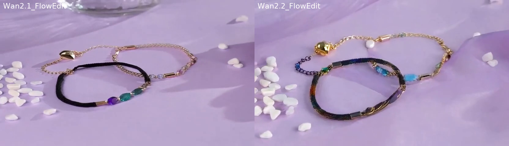
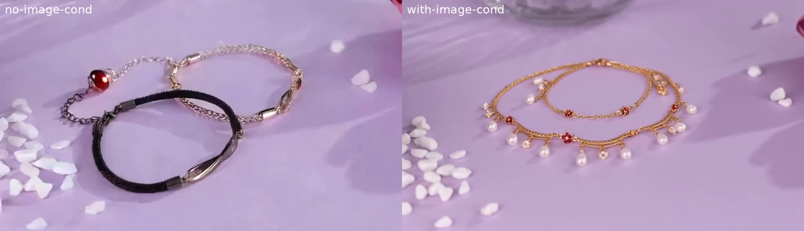
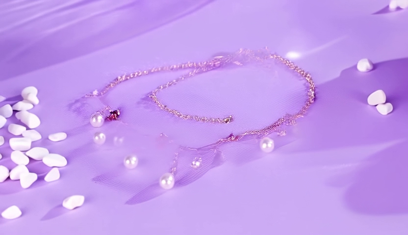
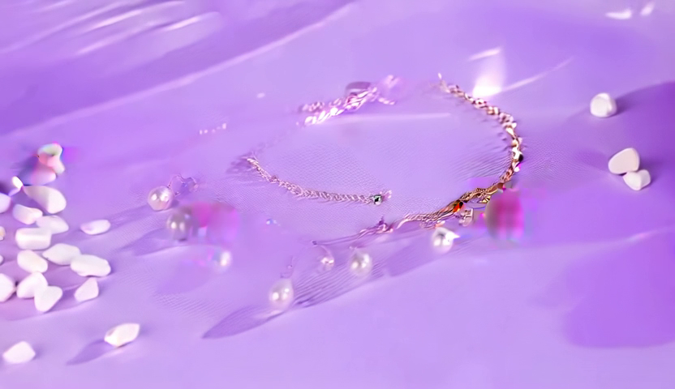
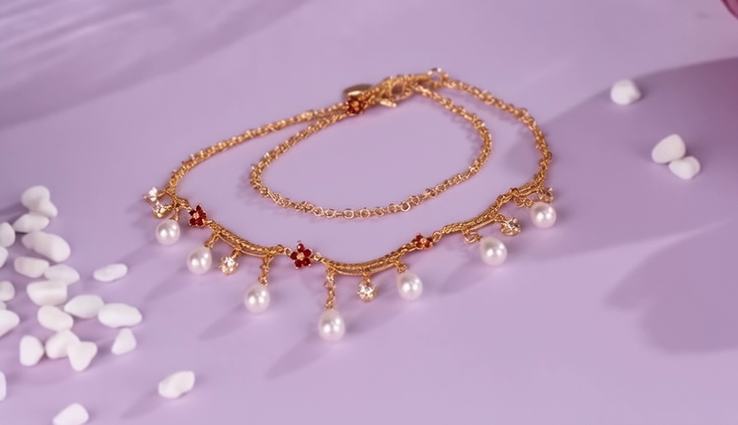
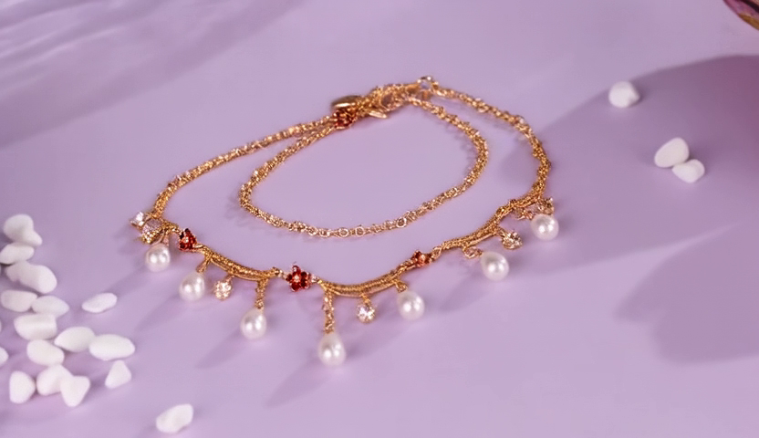

# PVTT 周报 - 2026-01-19

**项目**：Product Video Template Transfer (PVTT)
**当前阶段**：Baseline 开发 & 实验

---

## 本周工作概览

| 日期 | 主要工作 |
|------|----------|
| 01-18 | FlowEdit CFG Bug 修复、ti2v_flowedit.py 与 flowalign_t2v.py 对齐验证 |
| 01-19 | Wan2.1 vs Wan2.2 FlowEdit 对比、TI2V + FlowEdit 图像条件实验 |
| 01-19 | **RF-Solver 实现、CFG 参数实验、随机噪声 vs Inversion 对比** |

### 关键结论

1. **FlowEdit CFG 必须使用空字符串作为 negative prompt**：否则编辑效果失效
2. **ti2v_flowedit.py 与 flowalign_t2v.py 像素级一致**：相同参数下输出完全相同
3. **Wan2.1 和 Wan2.2 FlowEdit 效果相近**：之前观察到的差异来自算法不同（FlowAlign vs FlowEdit）
4. **TI2V + FlowEdit（有图像条件）失败**：首帧正确但后续帧退化，存在理论矛盾
5. **分辨率对齐至关重要**：源视频、目标首帧必须使用相同分辨率
6. **⭐ 随机噪声优于 Inversion**：跳过 Inversion 直接用随机噪声的效果反而更好！

---

## 实验记录

### 实验 1：FlowEdit CFG Bug 修复（01-18）

**问题发现**：之前 TI2V + FlowEdit 失败的原因是 CFG 实现错误。

**FlowEdit CFG 公式**：
```
V = uncond + scale * (cond - uncond)
```

**Bug**：错误地使用 `source_context` 作为 uncond，导致：
```
V = source + scale * (target - source)  # 错误
```
当 scale 较小时，编辑效果几乎为零。

**修复**：使用空字符串 `""` 作为 negative prompt（与 diffusers wan2.1 实现一致）：
```python
context_negative = text_encoder([""], device)  # 正确
```

**验证**：修复后 `ti2v_flowedit.py` 与 `flowalign_t2v.py` 输出**像素级完全相同**（mean_diff=0, max_diff=0）


**Tag**：`v0.1.0-flowedit-verified`

---

### 实验 2：Wan2.1 vs Wan2.2 FlowEdit 对比（01-19）

**实验目的**：验证 Wan2.1 和 Wan2.2 在相同算法下的编辑效果差异。

**实验设置**：
- 算法：FlowEdit（2-branch）
- 参数：strength=0.7, target_cfg=13.5, source_cfg=5.0, steps=50
- Prompt：相同的详细描述

**对比结果**：

| | Wan2.1 FlowEdit | Wan2.2 FlowEdit |
|---|---|---|
| 模型 | T2V-1.3B | TI2V-5B |
| 黑色手链 | 有彩色宝石 | 有蓝色元素 |
| 金链 | 金色链条 | 金色链条+吊坠 |
| **整体效果** | 中等 | 中等 |



**结论**：
1. **相同算法下，Wan2.1 和 Wan2.2 效果相近**
2. 之前观察到的 "Wan2.1 更好" 是因为对比的是 FlowAlign vs FlowEdit（不同算法）
3. FlowAlign（3-branch）编辑效果强于 FlowEdit（2-branch）

---

### 实验 3：TI2V + FlowEdit 图像条件实验（01-19）

**实验目的**：在 FlowEdit 中加入 TI2V 图像条件，让 source 分支条件于源视频首帧，target 分支条件于 Flux.2 生成的目标首帧。

**实验设置**：
```
Source: V(Zt_src, source_prompt, source_first_frame)
Target: V(Zt_tar, target_prompt, target_first_frame)
Update: Zt_edit += dt * (Vt_tar - Vt_src)
```

**实验结果**：

| | 无图像条件 | 有图像条件 |
|---|---|---|
| **首帧** | 源视频编辑结果 | ✅ 目标首帧（珍珠项链） |
| **后续帧** | 有编辑效果 | ❌ 退化为无图像条件状态 |



**问题分析**：

后续帧的 `Zt_tar` 仍然基于源视频计算：
```python
Zt_tar = Zt_edit + (Zt_src - X0_src)  # 后续帧基于源视频
Zt_tar_cond = [z_target[0], Zt_tar[1:]]  # 只替换首帧
```

模型看到的输入：
- 首帧：目标首帧（项链，t=0）
- 后续帧：源视频噪声版本（手链，t=t）

这种**首帧与后续帧内容不一致**导致模型困惑，velocity 预测对后续帧的转换能力很弱。

**理论矛盾**：

| FlowEdit 假设 | TI2V 图像条件要求 |
|---|---|
| source/target 分支处理**结构相同**的 latent | target 分支内容应与目标首帧**一致** |
| velocity 差异反映 prompt 编辑方向 | velocity 差异应反映首帧内容差异 |

这两个要求存在根本冲突。

**结论**：TI2V + FlowEdit（有图像条件）方案存在理论矛盾。根本原因是 FlowEdit 的 **Inversion-Free** 设计（见下节分析）。

---

### 分析：Inversion-Free 是根本原因

**核心问题**：FlowEdit 的 Inversion-Free 设计导致源视频内容被显式保留在 latent 中。

#### FlowEdit Inversion-Free 逻辑

```python
# 前向扩散：Zt_src 显式包含源视频 X0_src
Zt_src = (1-t) * X0_src + t * noise

# Zt_tar 基于 Zt_edit 计算，后续帧仍包含源视频结构
Zt_tar = Zt_edit + (Zt_src - X0_src)
```

**问题**：`Zt_tar` 的后续帧在 latent 空间中**显式包含源视频内容**，替换首帧无法改变这一点。模型看到不一致的输入（目标首帧 + 源视频后续帧），无法正确传播首帧信息。

#### 传统 Inversion 方法对比

| | FlowEdit (Inversion-Free) | 传统 Inversion |
|---|---|---|
| 源视频结构 | 显式保留在 latent 中 | 隐式编码在噪声中 |
| 目标内容 | 通过 velocity 差异"推动" | 通过去噪过程"生成" |
| 首帧条件传播 | ❌ 被源视频结构阻断 | ✅ 自然传播 |
| 计算成本 | 低（无需反演） | 高（需要完整反演） |

#### 潜在解决方案：RF-Solver

Wan 模型是 Flow Matching，不能用 DDIM Inversion。[RF-Solver](https://arxiv.org/abs/2411.04746)（ICML 2025）专为 Rectified Flow 设计：

```
Step 1: ZT = RF_Invert(X0_src, source_prompt)     # 反演源视频
Step 2: X0_tar = RF_Denoise(ZT, target_prompt, target_first_frame)  # TI2V 去噪
```

**为什么可能有效**：
1. `ZT` 只编码结构信息（运动、布局），不显式包含源视频内容
2. 去噪时 TI2V 模型根据目标首帧**生成**一致的后续帧
3. RF-Edit 的 attention 特征共享可进一步保留源视频运动

**参考资源**：
- 论文：[Taming Rectified Flow for Inversion and Editing](https://arxiv.org/abs/2411.04746)
- 代码：[RF-Solver-Edit GitHub](https://github.com/wangjiangshan0725/RF-Solver-Edit)

---

### 实验 4：RF-Solver Inversion 实现（01-19）

**实验目的**：实现 RF-Solver 二阶 Taylor 展开，测试是否能改善 Flow Matching Inversion 精度。

**RF-Solver 核心算法**：
```python
# 二阶 Taylor 展开
for each step (t → t+dt):
    1. v = model(z, t)                    # 当前速度
    2. z_mid = z + v * (dt/2)             # 半步到中点
    3. v_mid = model(z_mid, t + dt/2)     # 中点速度
    4. dv/dt = 2 * (v_mid - v) / dt       # 速度变化率
    5. z_next = z + v*dt + 0.5*dt²*(dv/dt) # 二阶更新
```

**关键发现：分辨率对齐**

源视频 (1280x1024) 与目标首帧 (832x480) 分辨率不一致导致后续帧严重退化！

**解决方案**：统一所有输入输出为 832x480，创建标准化案例数据：
```
data/pvtt-benchmark/cases/bracelet_to_necklace/
├── config.yaml          # 配置和 prompts
├── source_video.mp4     # 原视频 (832x480, 25帧)
├── source_frame1.png    # 原视频首帧
├── target_frame1.png    # 目标首帧 (Flux.2 生成)
└── product_image.jpg    # 产品参考图
```

**Euler vs RF-Solver 对比**：

| 方法 | Inverted noise std | 后续帧质量 |
|------|-------------------|-----------|
| Euler (一阶) | 0.77 | ❌ 退化严重 |
| RF-Solver (二阶) | 0.82 | ⚠️ 有改善但仍退化 |

**RF-Solver 结果截图** (cfg=5.0)：

| Frame 0 | Frame 12 |
|---------|----------|
|  |  |

---

### 实验 5：CFG 参数实验（01-19）

**实验目的**：测试不同 CFG 值对 TI2V 去噪效果的影响。

**实验结果**：

| CFG | 首帧 | 后续帧观察 |
|-----|------|-----------|
| 5.0 | ✅ 正确 | 有退化但项链可辨认 |
| 7.0 | ✅ 正确 | 与 5.0 类似 |
| 13.0 | ✅ 正确 | ❌ 过曝严重，颜色偏紫 |

**CFG=13 过曝示例** (Frame 12)：



**结论**：较高的 CFG 值反而导致更严重的退化，cfg=5.0 效果最好。

---

### 实验 6：⭐ 随机噪声 vs Inversion 对比（01-19）

**实验目的**：验证 Inversion 步骤是否真的有必要。

**实验设置**：
```bash
# 随机噪声（跳过 Inversion）
python ti2v_rfsolver.py --skip-inversion \
    --target-frame target_frame1.png \
    --width 832 --height 480 --steps 50 --cfg 5.0
```

**实验结果**：

| 方法 | 噪声来源 | Frame 12 质量 |
|------|---------|--------------|
| RF-Solver Inversion | 反演噪声 (std=0.82) | ⚠️ 有退化 |
| **随机噪声** | 标准高斯 (std=1.0) | ✅ **清晰一致** |

**对比截图**：

| | RF-Solver Inversion | 随机噪声 (skip-inversion) |
|---|---|---|
| **Frame 0** |  |  |
| **Frame 12** |  |  |

```
┌─────────────────────────────────────────────────────────────────┐
│   RF-Solver Inversion:                                          │
│   Frame 0 ✅ ──▶ Frame 6 ⚠️ ──▶ Frame 12 ⚠️   后续帧退化        │
│                                                                 │
│   随机噪声 (skip-inversion):                                     │
│   Frame 0 ✅ ──▶ Frame 6 ✅ ──▶ Frame 12 ✅   质量保持一致！     │
└─────────────────────────────────────────────────────────────────┘
```

**核心发现**：

**Inversion 不仅没有帮助，反而有害！**

原因分析：
1. **反演噪声不是"纯结构"**：仍包含源视频内容残留，与目标首帧冲突
2. **TI2V 模型已足够强大**：能从首帧正确推断后续帧，不需要 Inversion 引导
3. **噪声分布偏离**：反演噪声 std=0.82，偏离训练时的标准高斯分布

**结论**：最优方案是最简单的两阶段流程：
```
目标首帧 (Flux.2) + 随机噪声 ──▶ TI2V 去噪 ──▶ 目标视频
```

这验证了 **Flux.2 + TI2V 组合方法** 的有效性！

---

## 本周总结

### 技术路线演进

```
FlowEdit (Inversion-Free) ──▶ 失败：后续帧退化
         │
         ▼
RF-Solver Inversion ──▶ 部分改善但仍有退化
         │
         ▼
随机噪声 (无 Inversion) ──▶ ✅ 效果最好！
```

### 下一步计划

1. **多样本验证**：在更多案例上验证随机噪声方法的稳定性
2. **改进首帧生成**：优化 Flux.2 prompt engineering 和 reference image 使用
3. **运动控制**：探索 motion prompt、运动轨迹条件
4. **定量评估**：计算 CLIP-score、FVD 等指标

---

## 附录：关键实验视频

```
experiments/results/compositional/
├── compare_identical.mp4                  # ✅ ti2v vs flowalign 像素级对比
├── compare_wan21_vs_wan22_flowedit.mp4    # Wan2.1 vs Wan2.2 FlowEdit 对比
└── compare_image_cond.mp4                 # ❌ TI2V+FlowEdit 有/无图像条件对比

baseline/compositional-flux-ti2v/results/
├── ti2v_rfsolver.mp4                      # RF-Solver Inversion (cfg=5.0)
├── ti2v_rfsolver_cfg7.mp4                 # RF-Solver Inversion (cfg=7.0)
├── ti2v_rfsolver_cfg13.mp4                # RF-Solver Inversion (cfg=13.0)
└── ti2v_random_noise.mp4                  # ✅ 随机噪声（最佳结果）
```

## 附录：标准化案例数据

```
data/pvtt-benchmark/cases/bracelet_to_necklace/
├── config.yaml          # 配置和 prompts
├── source_video.mp4     # 原视频 (832x480, 25帧)
├── source_frame1.png    # 原视频首帧
├── target_frame1.png    # 目标首帧 (Flux.2 生成)
└── product_image.jpg    # 产品参考图（项链）
```
