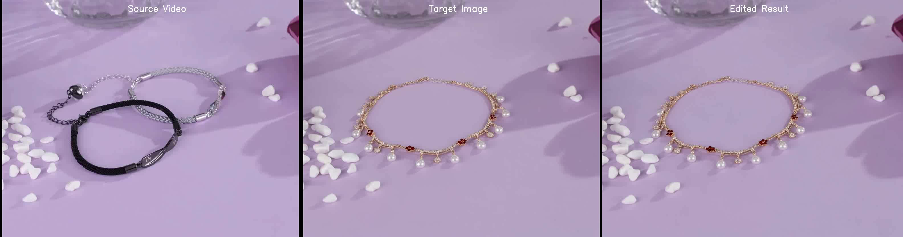
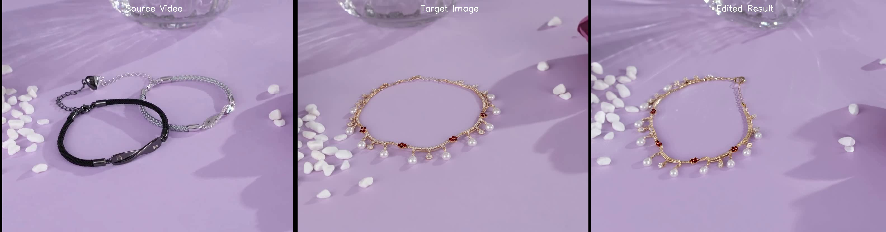
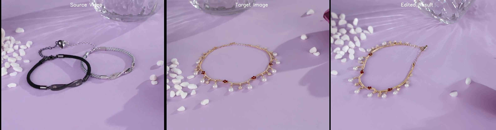

# Wan2.2 TI2V Inversion-Generation 视频编辑技术报告

## 1. 概述

本报告介绍基于 **Wan2.2 TI2V-5B** 模型的 **Inversion-Generation** 视频编辑方法。该方法通过将源视频反演到噪声空间，然后使用目标条件重新生成，实现高质量的视频编辑，同时保持源视频的运动模式。

### 1.1 任务定义

**输入：**
- 源视频 (Source Video)
- 源描述 (Source Prompt)
- 目标图像 (Target Image) - 编辑后的第一帧
- 目标描述 (Target Prompt)

**输出：**
- 编辑后的视频，第一帧与目标图像一致，运动模式与源视频一致

---

## 2. 方法原理

### 2.1 核心思想

基于 **Flow Matching** 模型的特性：模型学习了从噪声到数据的确定性映射路径（ODE轨迹）。通过**反转这个路径**，我们可以找到对应源视频的"噪声表示"，然后用**新的条件**从这个噪声重新生成。

### 2.2 算法流程

```
┌────────────────────────────────────────────────────────────────────────┐
│                         INVERSION-GENERATION                            │
├────────────────────────────────────────────────────────────────────────┤
│                                                                         │
│  输入: Source Video V_s, Source Prompt P_s, Target Image I_t, Target Prompt P_t
│                                                                         │
│  ┌─────────────────────────────────────────────────────────────────┐   │
│  │ STAGE 1: INVERSION (反演)                                        │   │
│  │                                                                   │   │
│  │  目标: 将源视频潜变量 X₀ 反演到噪声空间 X_T                        │   │
│  │                                                                   │   │
│  │  X₀ = VAE.encode(V_s)                                            │   │
│  │  Z_s = VAE.encode(V_s[0])  # 源视频第一帧                         │   │
│  │                                                                   │   │
│  │  for t = 0 → T:  (从干净到噪声，反向遍历sigma)                     │   │
│  │      1. 应用TI2V条件: X̃_t = (1-M)·Z_s + M·X_t                    │   │
│  │      2. 预测flow: v = Model(X̃_t, t, P_s)                         │   │
│  │      3. 反向更新: X_{t+1} = X_t + v · Δσ                         │   │
│  │                                                                   │   │
│  │  输出: X_T (反演噪声，编码了源视频的结构和运动信息)                 │   │
│  └─────────────────────────────────────────────────────────────────┘   │
│                                    │                                    │
│                                    ▼                                    │
│  ┌─────────────────────────────────────────────────────────────────┐   │
│  │ STAGE 2: GENERATION (生成)                                       │   │
│  │                                                                   │   │
│  │  目标: 从噪声 X_T 生成编辑后的视频 X₀'                            │   │
│  │                                                                   │   │
│  │  Z_t = VAE.encode(I_t)  # 目标图像                                │   │
│  │                                                                   │   │
│  │  for t = T → 0:  (从噪声到干净)                                   │   │
│  │      1. 应用TI2V条件: X̃_t = (1-M)·Z_t + M·X_t  [关键变化!]        │   │
│  │      2. 预测flow: v_c = Model(X̃_t, t, P_t)                       │   │
│  │      3. 无条件预测: v_u = Model(X̃_t, t, "")                      │   │
│  │      4. CFG引导: v = v_u + s·(v_c - v_u)                         │   │
│  │      5. 去噪更新: X_{t-1} = Scheduler.step(v, X_t)               │   │
│  │      6. 重新应用条件: X_{t-1} = (1-M)·Z_t + M·X_{t-1}            │   │
│  │                                                                   │   │
│  │  输出: X₀' (编辑后的视频潜变量)                                   │   │
│  └─────────────────────────────────────────────────────────────────┘   │
│                                    │                                    │
│                                    ▼                                    │
│  ┌─────────────────────────────────────────────────────────────────┐   │
│  │ STAGE 3: DECODE (解码)                                           │   │
│  │                                                                   │   │
│  │  V_edited = VAE.decode(X₀')                                      │   │
│  └─────────────────────────────────────────────────────────────────┘   │
│                                                                         │
│  输出: V_edited (编辑后的视频)                                          │
└────────────────────────────────────────────────────────────────────────┘

其中:
- M: TI2V mask，第一帧=0，其他帧=1
- Δσ: sigma差值（反演时为负，指向噪声方向）
- s: CFG guidance scale
```

### 2.3 关键技术点

#### 2.3.1 TI2V 第一帧条件机制

Wan2.2 TI2V 模型使用第一帧图像作为生成条件。通过 `masks_like` 函数创建掩码：

```python
# mask2: shape [C, F, H, W]
# 第一帧 mask2[:, 0, :, :] = 0
# 其他帧 mask2[:, 1:, :, :] = 1

# 应用条件
latent_input = (1 - mask2) * z_first_frame + mask2 * current_latent
```

**Inversion时**：使用源视频第一帧 `z_source_first`
**Generation时**：使用目标图像 `z_target_first` （这是编辑的关键！）

#### 2.3.2 Flow Matching Inversion

对于Flow模型，数据和噪声之间的关系由ODE定义：

$$\frac{dX_t}{dt} = v_\theta(X_t, t, c)$$

**正向生成**（训练时）：$X_0 \rightarrow X_T$（数据到噪声）
**反向生成**（推理时）：$X_T \rightarrow X_0$（噪声到数据）

**Inversion** 就是沿着ODE轨迹从数据走向噪声：

```python
# dsigma < 0，表示从低噪声到高噪声
dsigma = sigma_next - sigma_cur
X_{t+1} = X_t + flow_prediction * dsigma
```

#### 2.3.3 为什么能保持运动？

1. **Inversion 编码了时序信息**：源视频的运动轨迹被编码到噪声 X_T 的空间结构中
2. **共享初始噪声**：Generation 从同一个 X_T 出发，自然保留运动模式
3. **第一帧强制约束**：每一步都重新应用目标图像作为第一帧条件，确保内容一致性

---

## 3. 可视化效果

### 3.1 输入输出对比

| 源视频第一帧 | 目标图像 | 编辑结果第一帧 |
|:---:|:---:|:---:|
|  |  |  |

### 3.2 视频序列对比

#### 第 0 帧（起始）


#### 第 24 帧（中间）


#### 第 48 帧（结束）


**布局说明**：左侧为源视频，中间为目标图像，右侧为编辑结果

### 3.3 完整对比视频

视频文件位置：
- 编辑结果：`results/JEW002_inversion_edit_49frames.mp4`
- 三栏对比：`results/JEW002_comparison_49frames.mp4`

---

## 4. 代码实现

### 4.1 完整代码

```python
#!/usr/bin/env python3
"""
Wan2.2 TI2V Inversion-Generation Video Editing

Pipeline:
    Source Video + Source Prompt --> [Inversion] --> Inverted Noise
    Inverted Noise + Target Image + Target Prompt --> [Generation] --> Edited Video
"""
import argparse
import gc
import math
import os
import sys
import random
import torch
import imageio
import numpy as np
from PIL import Image
from tqdm import tqdm
import torchvision.transforms.functional as TF
from contextlib import contextmanager

sys.path.insert(0, os.path.dirname(os.path.abspath(__file__)))

from wan.configs import WAN_CONFIGS
from wan.modules.model import WanModel
from wan.modules.t5 import T5EncoderModel
from wan.modules.vae2_2 import Wan2_2_VAE
from wan.utils.fm_solvers import FlowDPMSolverMultistepScheduler
from wan.utils.fm_solvers_unipc import FlowUniPCMultistepScheduler
from wan.utils.utils import save_video, masks_like, best_output_size


def load_video(file_path: str, max_frames: int = None):
    """Load video frames as PIL images."""
    images = []
    vid = imageio.get_reader(file_path)
    fps = vid.get_meta_data()['fps']
    for i, frame in enumerate(vid):
        if max_frames and i >= max_frames:
            break
        pil_image = Image.fromarray(frame)
        images.append(pil_image)
    return images, fps


def process_image(img, ow, oh):
    """Resize and center-crop image to target size."""
    scale = max(ow / img.width, oh / img.height)
    img = img.resize((round(img.width * scale), round(img.height * scale)), Image.LANCZOS)
    x1 = (img.width - ow) // 2
    y1 = (img.height - oh) // 2
    img = img.crop((x1, y1, x1 + ow, y1 + oh))
    return TF.to_tensor(img).sub_(0.5).div_(0.5)


class TI2VInversionEditor:
    """Wan2.2 TI2V Video Editor using Inversion-Generation approach."""

    def __init__(self, ckpt_dir, device="cuda", offload_model=True):
        self.device = torch.device(device)
        self.offload_model = offload_model

        # Load config
        self.config = WAN_CONFIGS["ti2v-5B"]
        self.num_train_timesteps = self.config.num_train_timesteps
        self.param_dtype = self.config.param_dtype
        self.vae_stride = self.config.vae_stride
        self.patch_size = self.config.patch_size

        # Load models
        print(f"Loading models from {ckpt_dir}...")

        self.text_encoder = T5EncoderModel(
            text_len=self.config.text_len,
            dtype=self.config.t5_dtype,
            device=torch.device('cpu'),
            checkpoint_path=os.path.join(ckpt_dir, self.config.t5_checkpoint),
            tokenizer_path=os.path.join(ckpt_dir, self.config.t5_tokenizer),
        )

        self.vae = Wan2_2_VAE(
            vae_pth=os.path.join(ckpt_dir, self.config.vae_checkpoint),
            device=self.device
        )

        self.model = WanModel.from_pretrained(ckpt_dir)
        self.model.eval().requires_grad_(False)

        print("Models loaded successfully!")

    def encode_prompt(self, prompt):
        """Encode text prompt using T5."""
        self.text_encoder.model.to(self.device)
        context = self.text_encoder([prompt], self.device)
        if self.offload_model:
            self.text_encoder.model.cpu()
            torch.cuda.empty_cache()
        return context

    def edit_video(
        self,
        source_video,
        source_prompt,
        target_prompt,
        target_image=None,
        max_area=704 * 1280,
        frame_num=17,
        shift=5.0,
        inversion_steps=50,
        generation_steps=50,
        guide_scale_inversion=1.0,
        guide_scale_generation=5.0,
        n_prompt="",
        seed=-1,
    ):
        """Edit video using Inversion-Generation with TI2V conditioning."""
        device = self.device

        # === Preprocessing ===
        source_first = source_video[0]
        ih, iw = source_first.height, source_first.width
        dh = self.patch_size[1] * self.vae_stride[1]
        dw = self.patch_size[2] * self.vae_stride[2]
        ow, oh = best_output_size(iw, ih, dw, dh, max_area)

        F = min(frame_num, len(source_video))
        source_video = source_video[:F]

        # Calculate latent dimensions
        num_latent_frames = (F - 1) // self.vae_stride[0] + 1
        latent_h = oh // self.vae_stride[1]
        latent_w = ow // self.vae_stride[2]
        seq_len = num_latent_frames * latent_h * latent_w // (self.patch_size[1] * self.patch_size[2])

        # Process video frames -> [C, F, H, W]
        source_frames = [process_image(f, ow, oh) for f in source_video]
        source_video_tensor = torch.stack(source_frames, dim=1).to(device)
        source_first_tensor = source_video_tensor[:, :1, :, :]

        # Target first frame
        if target_image is not None:
            target_first_tensor = process_image(target_image, ow, oh).to(device).unsqueeze(1)
        else:
            target_first_tensor = source_first_tensor.clone()

        # === Encode ===
        context_source = self.encode_prompt(source_prompt)
        context_target = self.encode_prompt(target_prompt)
        context_null = self.encode_prompt(n_prompt if n_prompt else "")

        z_source = self.vae.encode([source_video_tensor])
        X0_src = z_source[0].to(device).to(torch.float32)

        z_source_first = self.vae.encode([source_first_tensor])[0].to(device)
        z_target_first = self.vae.encode([target_first_tensor])[0].to(device)

        # Create TI2V mask (first frame = 0, other frames = 1)
        mask1, mask2 = masks_like([X0_src], zero=True)
        mask2 = mask2[0].to(device)

        seed = seed if seed >= 0 else random.randint(0, sys.maxsize)
        seed_g = torch.Generator(device=device)
        seed_g.manual_seed(seed)

        @contextmanager
        def noop_no_sync():
            yield
        no_sync = getattr(self.model, 'no_sync', noop_no_sync)

        if self.offload_model:
            self.model.to(device)
            torch.cuda.empty_cache()

        # ============================================================
        # STAGE 1: INVERSION (x0 -> xT using source condition)
        # ============================================================
        inversion_scheduler = FlowDPMSolverMultistepScheduler(
            num_train_timesteps=self.num_train_timesteps,
            shift=1, use_dynamic_shifting=False
        )
        inversion_scheduler.set_timesteps(inversion_steps, device=device)
        inversion_sigmas = inversion_scheduler.sigmas

        current_latent = X0_src.clone()

        with torch.amp.autocast('cuda', dtype=self.param_dtype), torch.no_grad(), no_sync():
            for i in tqdm(range(len(inversion_sigmas) - 2, -1, -1), desc="Inversion"):
                sigma_cur = inversion_sigmas[i + 1]
                sigma_next = inversion_sigmas[i]

                t_cur_index = (inversion_scheduler.sigmas - sigma_cur).abs().argmin().item()
                t_cur_index = min(t_cur_index, len(inversion_scheduler.timesteps) - 1)
                t_cur = inversion_scheduler.timesteps[t_cur_index]
                timestep = torch.tensor([t_cur], device=device)

                # Apply SOURCE first-frame conditioning
                latent_input = (1. - mask2) * z_source_first + mask2 * current_latent.to(self.param_dtype)

                temp_ts = (mask2[0][:, ::2, ::2] * timestep).flatten()
                temp_ts = torch.cat([temp_ts, temp_ts.new_ones(seq_len - temp_ts.size(0)) * timestep])
                model_timestep = temp_ts.unsqueeze(0)

                flow_pred_cond = self.model(
                    [latent_input], t=model_timestep,
                    context=context_source, seq_len=seq_len
                )[0].to(torch.float32)

                if guide_scale_inversion > 1.0:
                    flow_pred_uncond = self.model(
                        [latent_input], t=model_timestep,
                        context=context_null, seq_len=seq_len
                    )[0].to(torch.float32)
                    predicted_flow = flow_pred_uncond + guide_scale_inversion * (flow_pred_cond - flow_pred_uncond)
                else:
                    predicted_flow = flow_pred_cond

                # Inversion update (negative dsigma -> towards noise)
                dsigma = sigma_next - sigma_cur
                current_latent = current_latent + predicted_flow * dsigma

        inverted_latent = current_latent.clone()
        del current_latent
        gc.collect()
        torch.cuda.empty_cache()

        # ============================================================
        # STAGE 2: GENERATION (xT -> x0 using target condition)
        # ============================================================
        generation_scheduler = FlowUniPCMultistepScheduler(
            num_train_timesteps=self.num_train_timesteps,
            shift=1, use_dynamic_shifting=False
        )
        generation_scheduler.set_timesteps(generation_steps, device=device, shift=shift)
        generation_timesteps = generation_scheduler.timesteps

        latent = inverted_latent.clone()

        with torch.amp.autocast('cuda', dtype=self.param_dtype), torch.no_grad(), no_sync():
            for i, t in enumerate(tqdm(generation_timesteps, desc="Generation")):
                timestep = torch.tensor([t], device=device)

                # Apply TARGET first-frame conditioning (KEY DIFFERENCE!)
                latent_input = (1. - mask2) * z_target_first + mask2 * latent.to(self.param_dtype)

                temp_ts = (mask2[0][:, ::2, ::2] * timestep).flatten()
                temp_ts = torch.cat([temp_ts, temp_ts.new_ones(seq_len - temp_ts.size(0)) * timestep])
                model_timestep = temp_ts.unsqueeze(0)

                noise_pred_cond = self.model(
                    [latent_input], t=model_timestep,
                    context=context_target, seq_len=seq_len
                )[0]

                noise_pred_uncond = self.model(
                    [latent_input], t=model_timestep,
                    context=context_null, seq_len=seq_len
                )[0]

                # CFG
                noise_pred = noise_pred_uncond + guide_scale_generation * (noise_pred_cond - noise_pred_uncond)

                # Scheduler step
                step_output = generation_scheduler.step(
                    noise_pred.unsqueeze(0), t, latent.unsqueeze(0),
                    return_dict=False, generator=seed_g
                )[0]
                latent = step_output.squeeze(0)

                # Re-apply first-frame conditioning
                latent = (1. - mask2) * z_target_first + mask2 * latent

        edited_latent = latent

        if self.offload_model:
            self.model.cpu()
            torch.cuda.synchronize()
            torch.cuda.empty_cache()

        # ============================================================
        # STAGE 3: DECODE
        # ============================================================
        output_video = self.vae.decode([edited_latent])

        gc.collect()
        torch.cuda.synchronize()

        return output_video[0]


def main():
    parser = argparse.ArgumentParser(description="Wan2.2 TI2V Inversion-Generation Video Editing")
    parser.add_argument("--ckpt_dir", type=str, required=True)
    parser.add_argument("--video", type=str, required=True)
    parser.add_argument("--source_prompt", type=str, required=True)
    parser.add_argument("--target_prompt", type=str, required=True)
    parser.add_argument("--target_image", type=str, default=None)
    parser.add_argument("--output", type=str, default="output_edited.mp4")
    parser.add_argument("--frame_num", type=int, default=17)
    parser.add_argument("--inversion_steps", type=int, default=50)
    parser.add_argument("--generation_steps", type=int, default=50)
    parser.add_argument("--guide_scale_inv", type=float, default=1.0)
    parser.add_argument("--guide_scale_gen", type=float, default=5.0)
    parser.add_argument("--shift", type=float, default=5.0)
    parser.add_argument("--seed", type=int, default=42)
    args = parser.parse_args()

    editor = TI2VInversionEditor(args.ckpt_dir)

    source_video, fps = load_video(args.video, max_frames=args.frame_num)

    target_image = None
    if args.target_image:
        target_image = Image.open(args.target_image).convert("RGB")

    output = editor.edit_video(
        source_video=source_video,
        source_prompt=args.source_prompt,
        target_prompt=args.target_prompt,
        target_image=target_image,
        frame_num=args.frame_num,
        shift=args.shift,
        inversion_steps=args.inversion_steps,
        generation_steps=args.generation_steps,
        guide_scale_inversion=args.guide_scale_inv,
        guide_scale_generation=args.guide_scale_gen,
        seed=args.seed,
    )

    os.makedirs(os.path.dirname(args.output) or ".", exist_ok=True)
    save_video(
        tensor=output[None],
        save_file=args.output,
        fps=16, nrow=1, normalize=True, value_range=(-1, 1)
    )
    print(f"Saved edited video to: {args.output}")


if __name__ == "__main__":
    main()
```

### 4.2 运行命令

```bash
# 激活环境
source /data/Anaconda3/etc/profile.d/conda.sh
conda activate wan_new

# 运行编辑
cd /data/lizhiying/Video-Editing/pvtt-main/baseline/flowedit-wan2.2

python ti2v_inversion_edit.py \
    --ckpt_dir /data/lizhiying/Wan2.2/model_params/Wan2.2-TI2V-5B \
    --video /path/to/source_video.mp4 \
    --source_prompt "Description of source video" \
    --target_prompt "Description of target video" \
    --target_image /path/to/target_first_frame.png \
    --output ./results/edited_video.mp4 \
    --frame_num 49 \
    --seed 42
```

### 4.3 参数说明

| 参数 | 默认值 | 说明 |
|------|--------|------|
| `--ckpt_dir` | 必填 | Wan2.2 TI2V-5B 模型路径 |
| `--video` | 必填 | 源视频路径 |
| `--source_prompt` | 必填 | 源视频文本描述 |
| `--target_prompt` | 必填 | 目标视频文本描述 |
| `--target_image` | None | 目标第一帧图像（可选） |
| `--output` | output_edited.mp4 | 输出路径 |
| `--frame_num` | 17 | 处理帧数（建议4n+1格式） |
| `--inversion_steps` | 50 | 反演步数 |
| `--generation_steps` | 50 | 生成步数 |
| `--guide_scale_inv` | 1.0 | 反演CFG（通常设为1.0） |
| `--guide_scale_gen` | 5.0 | 生成CFG |
| `--shift` | 5.0 | 噪声调度偏移 |
| `--seed` | 42 | 随机种子 |

---

## 5. 实验结果

### 5.1 实验设置

| 项目 | 值 |
|------|-----|
| 模型 | Wan2.2 TI2V-5B |
| 源视频 | JEW002.mp4 (珠宝手链) |
| 目标图像 | FLUX编辑后的第一帧 (珠宝项链) |
| 帧数 | 49 |
| 分辨率 | 1056 x 832 |
| GPU | NVIDIA GPU |

### 5.2 性能指标

| 阶段 | 17帧 | 49帧 |
|------|------|------|
| Inversion | ~18秒 | ~57秒 |
| Generation | ~36秒 | ~115秒 |
| **总计** | **~55秒** | **~3分钟** |

### 5.3 效果分析

**优点：**
1. **运动保持良好**：编辑后的视频保持了源视频的运动模式
2. **第一帧高度一致**：与目标图像完全匹配
3. **时序连贯**：后续帧自然过渡，无明显闪烁

**适用场景：**
- 产品替换（如本例：手链→项链）
- 物体外观修改
- 背景保持的主体替换

---

## 6. 与其他方法对比

| 方法 | 原理 | 优点 | 缺点 |
|------|------|------|------|
| **Inversion-Generation** | 反演+重生成 | 简洁，运动保持好 | 需要两阶段 |
| FlowAlign | 去噪过程中耦合 | 单阶段，可控性强 | 计算量大，需同时运行源/目标 |
| DDIM Inversion | 确定性反演 | 经典方法 | 对Flow模型重建质量差 |
| Attention Injection | 注入源注意力 | 结构保持好 | 需要存储大量注意力图 |

---

## 7. 总结

本报告介绍了基于 Wan2.2 TI2V-5B 的 Inversion-Generation 视频编辑方法。该方法：

1. **原理清晰**：通过反演源视频到噪声空间，再用目标条件重新生成
2. **实现简洁**：两阶段流程，代码易于理解和修改
3. **效果良好**：能够在保持运动的同时实现内容编辑

关键创新点在于利用 **TI2V 的第一帧条件机制**，在 Inversion 和 Generation 阶段分别使用源图像和目标图像作为条件，实现了平滑的内容替换。

---

## 8. 参考

- Wan2.1/2.2: Open and Advanced Large-Scale Video Generative Models
- Flow Matching for Generative Modeling
- DDIM: Denoising Diffusion Implicit Models

---

*报告生成时间：2025年1月*
