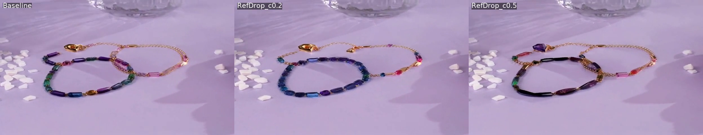

# FlowEdit/FlowAlign 基线实验

**日期**: 2026-01-04 ~ 2026-01-05
**主题**: FlowEdit/FlowAlign × Wan2.1/2.2 基线对比
**测试用例**: test01-test04 (多种产品转换)

---

## 实验背景

评估 FlowEdit 和 FlowAlign 在 Wan2.1 和 Wan2.2 上的效果，确定基线方法。

---

## 实验配置

### 模型

| 模型 | 版本 | 参数量 |
|------|------|--------|
| Wan2.1-T2V | 1.3B | 文本到视频 |
| Wan2.2-TI2V | 5B | 首帧条件视频生成 |

### 参数设置

```yaml
frames: 49
resolution: 480p (832x480 或 480x832)
steps: 50
strength: 0.7
guidance_scale: 19.5
attention_masking: layers 11-17
```

---

## 测试用例

| 测试ID | 类别 | 转换 | 结果 |
|--------|------|------|------|
| test01 | Jewelry | Watch → Bracelet | test01_flowalign_watch_to_bracelet.mp4 |
| test02 | Home | Tray → Flowers | test02_flowalign_tray_to_flowers.mp4 |
| test03 | Toys | Stacker → Toy | test03_flowalign_stacker_to_ridetoy.mp4 |
| test04 | Clothing | Socks → Skirt | test04_flowalign_socks_to_skirt.mp4 |

---

## 方法对比

### FlowEdit vs FlowAlign

| 方法 | 分支数 | 特点 |
|------|--------|------|
| FlowEdit | 2 | Source/Target 独立 CFG |
| FlowAlign | 3 | 额外 zeta_scale 正则化 |

### Wan2.1 vs Wan2.2

| 模型 | 优点 | 缺点 |
|------|------|------|
| Wan2.1 | 稳定、速度快 | 无首帧条件 |
| Wan2.2 TI2V | 支持首帧条件 | 配置更复杂 |

---

## 实验结果

**4-way 对比视频**: FlowEdit/FlowAlign × Wan2.1/2.2

### 结果截图

**Test02 FlowAlign 对比** (bracelet → necklace):



### 关键发现

1. **FlowAlign 效果优于 FlowEdit**
   - FlowAlign 的 zeta_scale 正则化有助于保持时序一致性
   - FlowEdit 在某些场景下会出现闪烁

2. **Wan2.1 作为基线更稳定**
   - Wan2.2 TI2V 需要额外的首帧条件处理
   - 对于纯 prompt 引导的编辑，Wan2.1 足够

3. **Pillow 泛化测试**
   - 在枕套案例上验证方法泛化性
   - FlowAlign 效果一致

---

## 结论

1. **FlowAlign (Wan2.1)** 确定为基线方法
2. 参数配置：strength=0.7, cfg=19.5, MasaCtrl masking
3. 产品替换效果：能改变产品类型，但细节控制有限

---

## 相关文件

- 配置: `baseline/flowedit-wan2.1/config/pvtt/`
- 结果: `experiments/results/flowalign-wan2.1/`
- 代码: `baseline/flowedit-wan2.1/awesome_wan_editing.py`
