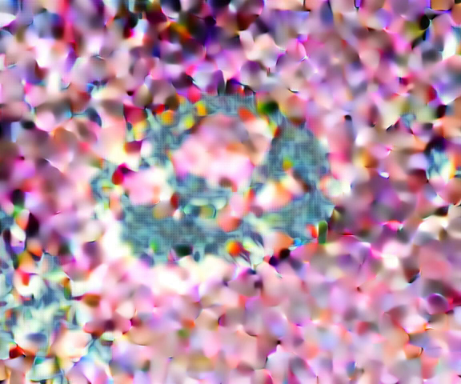
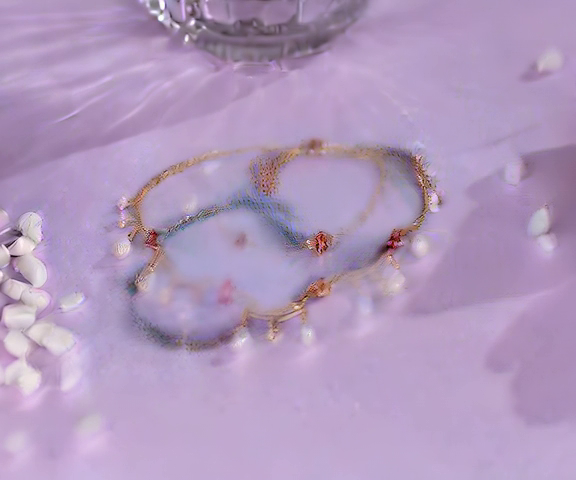

# 组合式方法 (Flux.2 + TI2V) 实验

**日期**: 2026-01-09 ~ 2026-01-10
**主题**: 两阶段组合式产品视频生成
**测试用例**: bracelet → pearl necklace

---

## 实验背景

放弃端到端 Training-Free 方法，改用两阶段组合式方法。

### 方法架构

```
模板视频第一帧 ──┐
                ├──▶ Flux.2 Dev Edit ──▶ 目标第一帧 ──▶ Wan2.1 TI2V ──▶ 目标视频
目标产品图片 ───┘
```

| 阶段 | 模型 | 任务 |
|------|------|------|
| Stage 1 | Flux.2 Dev (32B) | 多图编辑：替换产品，保持场景 |
| Stage 2 | Wan2.1 I2V (14B) | 从第一帧生成视频 |

---

## Stage 1: Flux.2 首帧生成

### 效果评估

Flux.2 Dev 多图编辑能力很强：
- 成功将手环替换为珍珠项链
- 保持了紫色丝绸背景、心形装饰、玻璃容器等场景元素
- 光照和阴影自然
- 产品细节（珍珠、金链）清晰

### 结果

| 输入 | 输出 |
|------|------|
| source_frame1.png + product_image.jpg | target_frame1.png |

### 结果截图

| Frame 0 (Flux.2 生成) | Frame 9 (TI2V 生成) |
|----------------------|---------------------|
|  |  |

---

## Stage 2: TI2V 视频生成

### v1 问题

使用 generic prompt，生成了随机运动。

### v2 改进

分析原视频运动模式，写精确的 motion prompt：

```
The camera slowly orbits from a top-down angle to a frontal eye-level view,
revealing the jewelry from different perspectives. Smooth cinematic arc movement.
```

### v2 结果

| 维度 | 评估 |
|------|------|
| 运动方向 | 正确（俯视 → 平视弧形运动） |
| 背景物品位置 | 有偏移（白色花瓣、玻璃容器） |
| 光照变化 | 不准确 |

**根本原因**: TI2V 只参考第一帧，无法获取原视频后续帧的信息。

---

## 混合方法对比

### Pure FlowEdit vs Flux+TI2V

| 方法 | 产品替换 | 运动保持 | 背景一致性 |
|------|---------|---------|-----------|
| Pure FlowEdit | 一般 | 完美 | 完美 |
| **Flux.2 + TI2V** | **最佳** | 正确 | 轻微漂移 |

---

## 核心发现

### 1. Flux.2 产品替换效果最佳

- 图像编辑能力强于视频编辑方法
- 能准确替换产品同时保持场景

### 2. TI2V 运动控制依赖 prompt

- 需要手写精确的 motion prompt
- 无法自动继承原视频运动

### 3. 两阶段方法的优缺点

| 优点 | 缺点 |
|------|------|
| Stage 1 产品替换效果好 | 无法参考原视频后续帧 |
| 语义正确（产品 + 运动方向） | 背景/光照随时间变化不准确 |
| 两阶段可分别调试 | 需要手写 motion prompt |

---

## 结论

1. **Flux.2 + TI2V 组合方法**在产品替换场景优于端到端方法
2. **Prompt engineering** 是关键：prompt 必须准确描述目标产品
3. **背景漂移**是主要问题，需要后续改进

---

## 后续方向

1. 提取原视频运动信息（光流、相机轨迹）作为 TI2V 条件
2. 逐帧编辑：对每帧用 Flux.2 编辑，保持时序一致性
3. 混合方法：Stage 1 生成第一帧 + FlowEdit 做视频编辑
4. Motion ControlNet：用原视频运动作为控制信号

---

## 相关文件

- Stage 1: `baseline/compositional-flux-ti2v/scripts/flux_edit.py`
- Stage 2: `baseline/compositional-flux-ti2v/scripts/ti2v_generate.py`
- 结果: `experiments/results/compositional/`
- 对比视频: `comparison_4way.avi`
