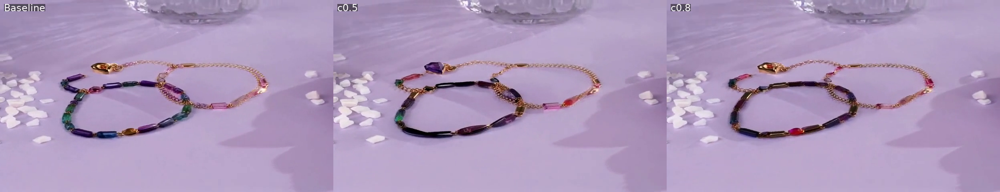
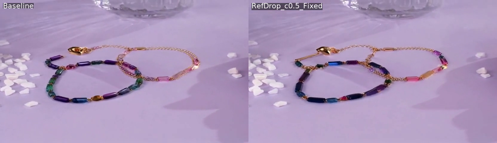

# Reference Attention (RefDrop) 实验

**日期**: 2026-01-05 ~ 2026-01-09
**主题**: RefDrop 图像引导视频编辑
**测试用例**: test02 bracelet → necklace

---

## 实验背景

将 RefDrop (NeurIPS 2024) 方法适配到视频编辑场景，用真实产品图片引导生成。

### PVTT 适配关键改动

- **原文**: reference 是生成的图片（参与 denoising）
- **我们的适配**: 使用真实产品图片的 clean features (t=0)
- 预提取 K_ref, V_ref，所有 denoising step 复用

### 核心公式

```
X' = c * Attention(Q, K_ref, V_ref) + (1-c) * Attention(Q, K, V)
```

---

## 实验配置

| 参数 | 值 |
|------|-----|
| 测试用例 | test02 bracelet → necklace |
| Source | bracelet_shot1.mp4 |
| Reference | JEWE005_source.jpg (金色珍珠项链) |
| 基础方法 | FlowAlign / FlowEdit (Wan2.1) |

---

## 第一轮：错误 Prompt（colorful gemstone）

使用了与参考图不匹配的 prompt：`colorful gemstone pendants`

| c 值 | 方法 | 效果 |
|------|------|------|
| - | FlowAlign Baseline | 彩色宝石项链 |
| 0.2 | FlowAlign + RefDrop | **黑色棋盘伪影** |
| 0.5 | FlowAlign + RefDrop | 几乎无编辑 |
| 0.8 | FlowAlign + RefDrop | 完全无编辑 |
| 0.2 | FlowEdit + RefDrop | 几乎无编辑 |
| 0.05 | FlowEdit + RefDrop | 彩色宝石+金链 |

**问题发现**: 参考图是珍珠项链，但生成结果一颗珍珠都没有！

---

## 第二轮：正确 Prompt（white pearl）

修正 prompt 为：`white pearl drop pendants`

| c 值 | 方法 | 珍珠效果 |
|------|------|---------|
| - | FlowEdit Baseline | 有珍珠，混有粉色珠子 |
| **0.05** | FlowEdit + RefDrop | **珍珠最多最纯净** |
| 0.1 | FlowEdit + RefDrop | 有珍珠+红宝石 |
| 0.2 | FlowEdit + RefDrop | 无珍珠（编辑被阻断） |

### 结果截图

**c=0.05 vs c=0.8 对比**:



**c=0.05 最佳结果**:



---

## 第三轮：Noisy RefDrop vs Clean RefDrop

**假设**: Clean RefDrop 在 t=0 提取特征，可能与高噪声 timestep 的视频特征分布不匹配。

**Noisy RefDrop 方法**:
- 每个 denoising step，给参考图添加与当前 timestep 匹配的噪声
- 从 noisy reference 提取 K_ref, V_ref

| 方法 | c=0.05 | c=0.2 |
|------|--------|-------|
| Clean RefDrop | 有珍珠 | 无珍珠 |
| Noisy RefDrop | 有珍珠 | 无珍珠 |

**结论**: Noisy RefDrop 无显著提升，假设不成立。

---

## 核心发现

### 1. Prompt 是关键，必须与参考图匹配

```
错误 prompt + 珍珠参考图 → 生成彩色宝石
正确 prompt + 珍珠参考图 → 生成珍珠项链
```

**结论**: 文本 prompt 主导生成内容，参考图提供微调。

### 2. c 值对编辑方法敏感

| 方法 | 可用 c 值范围 |
|------|--------------|
| FlowAlign | c < 0.2 (否则伪影) |
| FlowEdit | c = 0.05-0.1 |

### 3. RefDrop 与编辑机制冲突

- FlowAlign/FlowEdit 依赖 self-attention 传递时序/编辑信息
- RefDrop 用静态图像特征替换 self-attention 输出
- 高 c 值破坏编辑信号

### 4. RefDrop 提供微调作用

在正确 prompt 基础上，c=0.05 能让结果更接近参考图。

---

## 最佳实践

```yaml
flowedit:
    use_reference_attention: True
    ref_c: 0.05  # 不要超过 0.1
    # target_prompt 必须与参考图内容匹配！
```

---

## 结论

1. **RefDrop 作用有限**：prompt 主导，参考图只提供微调
2. **c 值必须极小**：0.05 是最佳值，更大会阻断编辑
3. **Noisy RefDrop 无提升**：特征分布不匹配不是主要问题
4. **机制冲突**：RefDrop 与 FlowEdit 的 self-attention 机制冲突

---

## 相关文件

- 代码: `baseline/flowedit-wan2.1/flowalign_refdrop.py`
- 分支: `feature/noisy-refdrop`
- 结果: `experiments/results/flowalign-wan2.1/test02_*.mp4`
