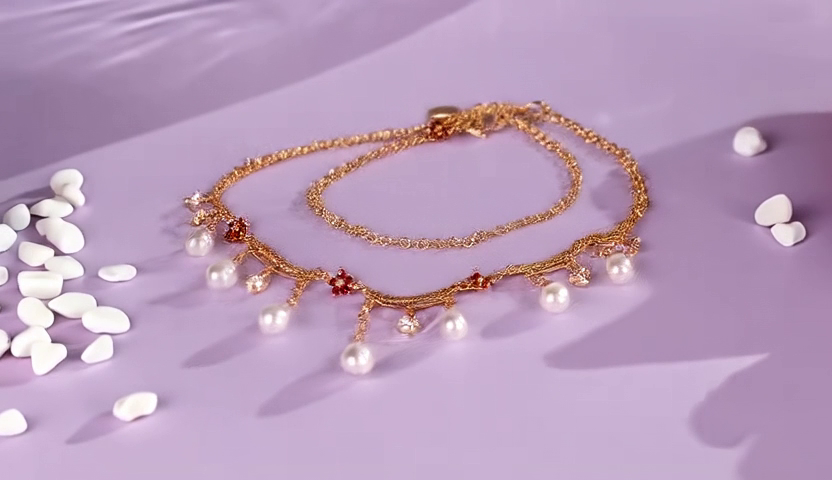
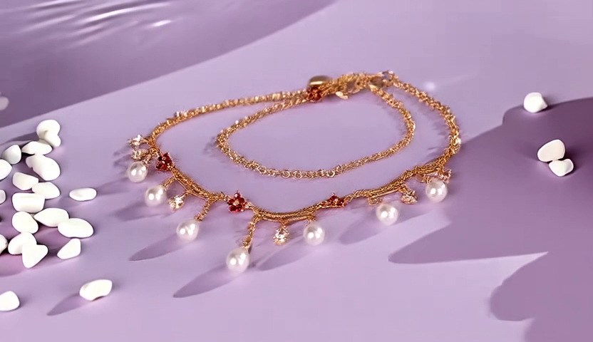
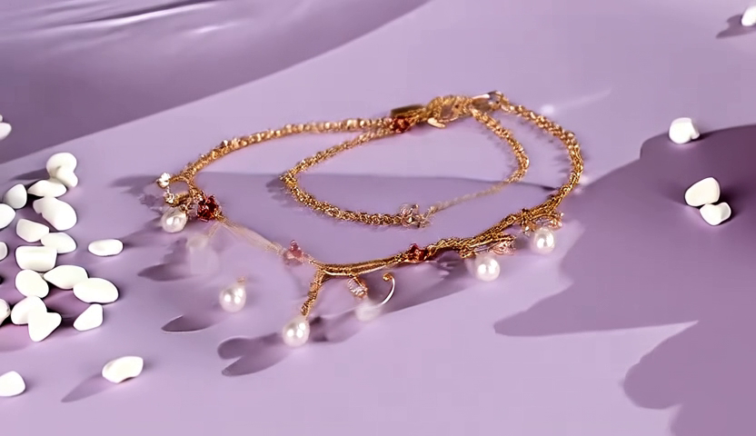
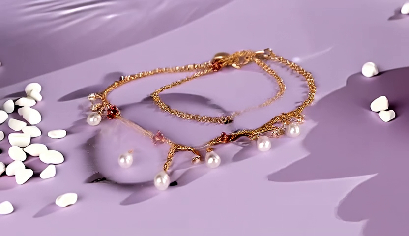
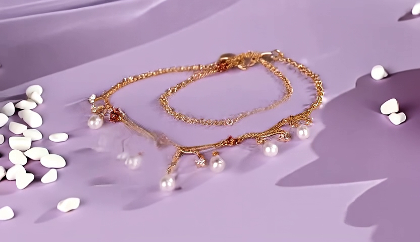
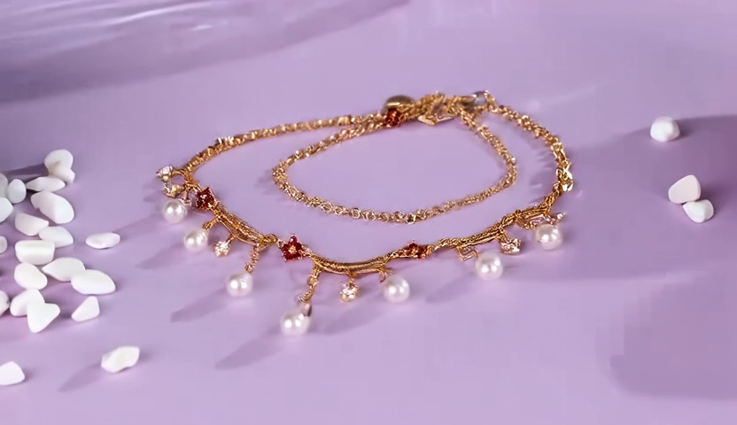

# RF-Solver 帧数消融实验

**日期**: 2026-01-20
**主题**: 帧数对 Inversion 质量的影响
**测试用例**: bracelet_to_necklace (832x480)

---

## 实验背景

在之前的 shift 消融实验中，发现 25 帧与 49 帧的 inversion 质量有差异。本实验系统测试不同帧数对 inversion 质量的影响。

---

## 实验配置

| 参数 | 值 |
|------|-----|
| 方法 | RF-Solver (二阶) + TI2V 首帧条件 |
| steps | 50 |
| cfg | 5.0 |
| shift | 0.5 |
| 分辨率 | 832x480 |
| 数据路径 | `data/pvtt-benchmark/cases/bracelet_to_necklace/` |

---

## 实验结果

| 帧数 | 时长 (24fps) | Inverted std | 与 1.0 差距 | 视觉质量 |
|------|-------------|-------------|------------|---------|
| 17 | 0.71s | 1.1118 | +0.11 | ✅ 清晰，珍珠完整 |
| 25 | 1.04s | 1.0737 | +0.07 | ✅ 清晰，珍珠完整 |
| 33 | 1.38s | 1.0465 | +0.05 | ⚠️ 链条模糊，珍珠变形 |
| 41 | 1.71s | 1.0297 | +0.03 | ❌ 链条模糊，珍珠消失 |
| 49 | 2.04s | 1.0194 | +0.02 | ❌ 链条更模糊，珍珠消失 |
| **81** | 3.38s | **0.9977** | **-0.002** | ✅ **效果好，比 41/49 好很多** |

---

## 结果对比

### 视频对比

**6-way 对比** (17f, 25f, 33f, 41f, 49f, 81f):

[查看对比视频](../results/compositional/comparison_frames_all_shift0.5.mp4)

### 第17帧视觉对比

| 17帧视频 (std=1.11) | 25帧视频 (std=1.07) |
|:------------------:|:------------------:|
|  |  |

| 33帧视频 (std=1.05) | 41帧视频 (std=1.03) |
|:------------------:|:------------------:|
|  |  |

| 49帧视频 (std=1.02) | 81帧视频 (std=1.00) |
|:------------------:|:------------------:|
|  |  |

---

## 核心发现

### 1. std 接近 1.0 不代表视觉质量更好

```
17帧  →  std=1.11  →  视觉质量 ✅ 最佳
25帧  →  std=1.07  →  视觉质量 ✅ 很好
33帧  →  std=1.05  →  视觉质量 ⚠️ 开始退化
41帧  →  std=1.03  →  视觉质量 ❌ 明显退化
49帧  →  std=1.02  →  视觉质量 ❌ 严重退化
81帧  →  std=1.00  →  视觉质量 ✅ 好（比 41/49 好很多）
```

**关键洞察**：std 与视觉质量没有单调关系！

### 2. 存在"坏区间"：33-49 帧质量最差

```
好 → 17, 25 帧
差 → 33, 41, 49 帧  ← 坏区间
好 → 81 帧
```

可能原因：
- **VAE 时间压缩**：vae_stride[0]=4，不同帧数对应不同的 latent_f
- **模型训练分布**：TI2V 可能在某些帧数上训练更多
- **待进一步研究**

### 3. std 不是可靠的质量指标

- 17-25 帧：std 偏离 1.0 较多（+0.07~0.11），但视觉质量最好
- 81 帧：std 几乎完美（0.9977），视觉质量也好
- 41-49 帧：std 接近 1.0，但视觉质量最差

---

## 验证实验：49帧 + 不同 shift

尝试通过调整 shift 改善 49 帧的视觉质量。

| shift | std | 视觉质量 |
|-------|-----|---------|
| 0.2 | 1.0235 | ⚠️ 略好于 0.5 |
| 0.3 | 1.0244 | ⚠️ 略好于 0.5 |
| 0.5 | 1.0194 | ❌ 差 |
| 1.0 | 0.9999 | ❌ 差 |

### 对比视频

[查看49帧 shift 对比视频](../results/compositional/comparison_49f_shift_grid.mp4)

### 结论

- **shift=0.2 和 shift=0.3 略有改善**，但仍然比 25 帧差很多
- **调整 shift 无法弥补帧数多带来的质量下降**
- 帧数本身是限制因素，不是 shift 参数的问题

---

## 结论

1. **std 接近 1.0 不代表视觉质量更好**
2. **存在"坏区间"**：33-49 帧质量最差，17-25 帧和 81 帧都好
3. **17-25 帧仍是推荐选择**，短且质量好
4. **81 帧可用于长视频需求**，效果出乎意料地好
5. **帧数与质量的关系不是单调的**，需要更多实验理解规律

---

## 相关文件

- 代码: `baseline/compositional-flux-ti2v/scripts/ti2v_rfsolver.py`
- 数据: `data/pvtt-benchmark/cases/bracelet_to_necklace/`
- 结果视频:
  - `experiments/results/compositional/frames_ablation_17f.mp4`
  - `experiments/results/compositional/frames_ablation_25f.mp4`
  - `experiments/results/compositional/frames_ablation_33f.mp4`
  - `experiments/results/compositional/frames_ablation_41f.mp4`
  - `experiments/results/compositional/frames_ablation_49f.mp4`
  - `experiments/results/compositional/frames_ablation_81f.mp4`
- 第17帧截图:
  - `experiments/results/compositional/frame17_from_17f.png`
  - `experiments/results/compositional/frame17_from_25f.png`
  - `experiments/results/compositional/frame17_from_33f.png`
  - `experiments/results/compositional/frame17_from_41f.png`
  - `experiments/results/compositional/frame17_from_49f.png`
  - `experiments/results/compositional/frame17_from_81f.png`
- 对比视频: `experiments/results/compositional/comparison_frames_all_shift0.5.mp4`
