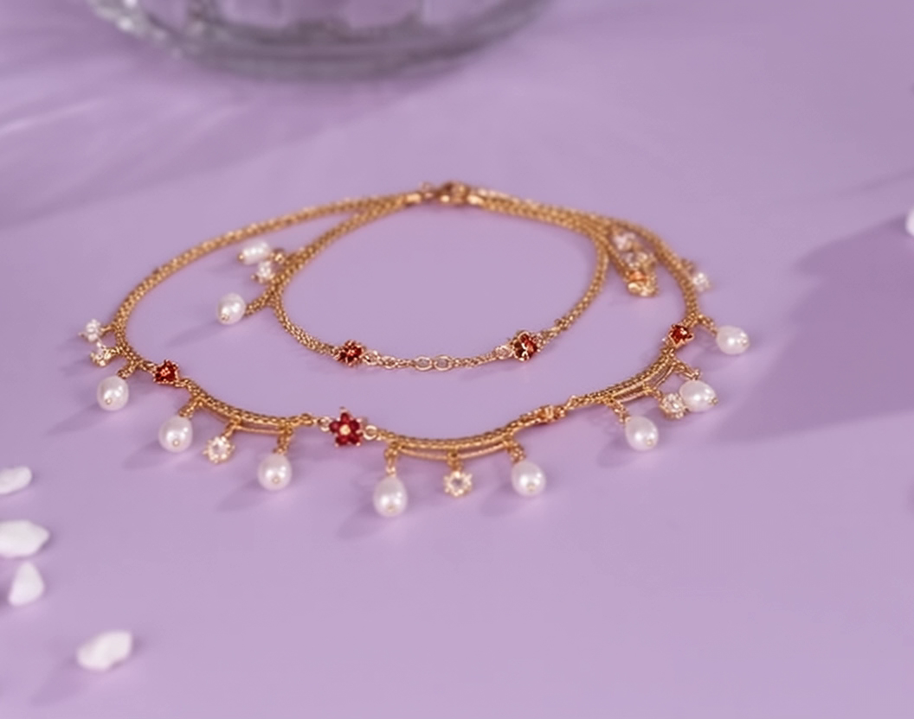
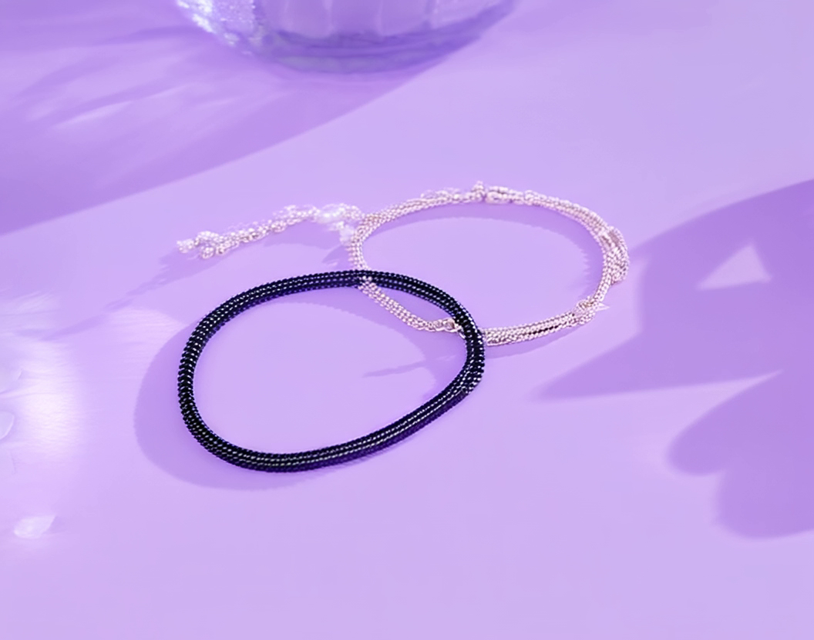
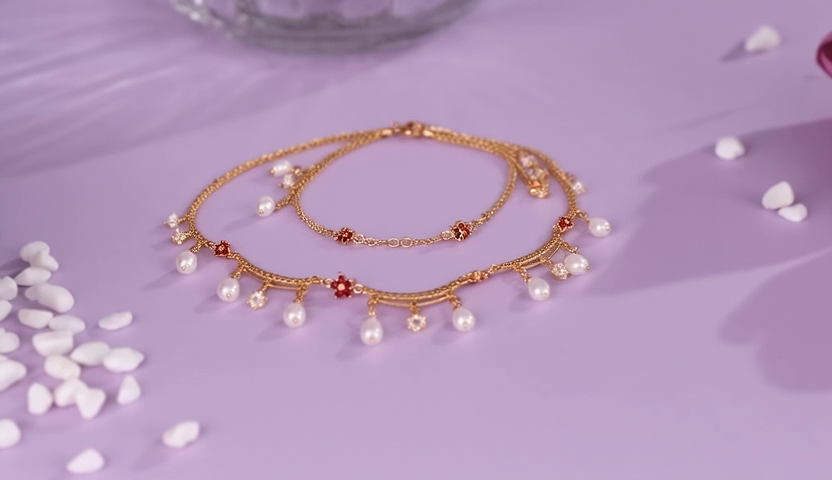

# RF-Solver Inversion vs 随机噪声对比实验

**日期**: 2026-01-19
**主题**: Flow Matching Inversion 方法对比
**测试用例**: bracelet_to_necklace (832x480, 25帧)

---

## 实验背景

验证 Inversion 步骤是否真的有必要，对比反演噪声与随机噪声的效果。

### RF-Solver 算法

使用二阶 Taylor 展开进行 Flow Matching Inversion：

```python
# RF-Solver 二阶 Taylor 展开
for each step (t → t+dt):
    1. v = model(z, t)                    # 当前位置的速度
    2. z_mid = z + v * (dt/2)             # 半步到中点
    3. v_mid = model(z_mid, t + dt/2)     # 中点的速度
    4. dv/dt = 2 * (v_mid - v) / dt       # 估计速度变化率
    5. z_next = z + v*dt + 0.5*dt²*(dv/dt) # 二阶更新
```

### Pipeline

```
┌─────────────────────────────────────────────────────────────────┐
│   源视频 ──▶ RF-Solver Inversion (t:0→1) ──▶ 噪声 zT           │
│                    (source_prompt)                              │
│                          │                                      │
│                          ▼                                      │
│   目标首帧 ──▶ 替换 zT 首帧 ──▶ TI2V 去噪 (t:1→0) ──▶ 目标视频  │
│                               (target_prompt + CFG)             │
└─────────────────────────────────────────────────────────────────┘
```

---

## 关键发现：分辨率对齐至关重要

**问题**: 源视频 (1280x1024) 与目标首帧 (832x480) 分辨率不一致导致后续帧严重退化。

**解决**: 统一所有输入输出为 832x480：
- 裁剪源视频到 832x480
- 提取源视频首帧 (832x480)
- 用 Flux.2 从源首帧生成目标首帧 (832x480)

---

## Euler vs RF-Solver 对比

| 方法 | Inverted std | 后续帧质量 |
|------|-------------|-----------|
| Euler (一阶) | 0.77 | 退化严重 |
| RF-Solver (二阶) | 0.82 | 有改善但仍退化 |

---

## CFG 参数实验

| CFG | 首帧 | 后续帧观察 |
|-----|------|-----------|
| 5.0 | 正确 | 有退化但项链可辨认 |
| 7.0 | 正确 | 与 5.0 类似 |
| 13.0 | 正确 | 过曝严重，颜色偏紫 |

**结论**: 较高的 CFG 值反而导致更严重的退化。

---

## 随机噪声 vs Inversion 对比

| 方法 | 噪声来源 | std | Frame 0 | Frame 12 | 整体质量 |
|------|---------|-----|---------|----------|---------|
| RF-Solver | 反演噪声 | 0.82 | 正确 | 有退化 | 一般 |
| **随机噪声** | 标准高斯 | **1.0** | 正确 | **清晰一致** | **最佳** |

### 结果截图

**RF-Solver Inversion (std=0.82)**:

| Frame 0 | Frame 8 |
|---------|---------|
|  |  |

**随机噪声 (std=1.0)** - 注意后续帧质量明显更好:

| Frame 0 | Frame 12 |
|---------|----------|
|  |  |

---

## 核心发现

### 随机噪声效果明显优于 Inversion！

```
┌─────────────────────────────────────────────────────────────────┐
│   RF-Solver Inversion:                                          │
│   ┌─────────┐     ┌─────────┐     ┌─────────┐                  │
│   │ Frame 0 │ ──▶ │ Frame 6 │ ──▶ │Frame 12 │                  │
│   │   ✅    │     │   ⚠️    │     │   ⚠️    │  后续帧退化       │
│   └─────────┘     └─────────┘     └─────────┘                  │
│                                                                 │
│   随机噪声 (skip-inversion):                                     │
│   ┌─────────┐     ┌─────────┐     ┌─────────┐                  │
│   │ Frame 0 │ ──▶ │ Frame 6 │ ──▶ │Frame 12 │                  │
│   │   ✅    │     │   ✅    │     │   ✅    │  质量保持一致！    │
│   └─────────┘     └─────────┘     └─────────┘                  │
└─────────────────────────────────────────────────────────────────┘
```

### 原因分析

1. **Inversion 噪声不是"纯结构"**
   - 预期反演噪声只编码运动/结构信息
   - 实际可能仍包含源视频的内容残留
   - 这些残留与目标首帧冲突

2. **TI2V 模型已足够强大**
   - Wan2.2 TI2V-5B 本身就是为首帧条件生成设计的
   - 模型能够从首帧正确推断后续帧
   - 不需要额外的 Inversion 来"引导"运动

3. **噪声标准差的影响**
   - 随机噪声 std=1.0（标准高斯）
   - 反演噪声 std=0.82（偏离标准分布）
   - TI2V 训练时使用的是标准高斯噪声

---

## 结论

**Inversion 步骤不仅没有帮助，反而有害！**

最优方案是最简单的两阶段流程：

```
目标首帧 (Flux.2) + 随机噪声 ──▶ TI2V 去噪 ──▶ 目标视频
```

这与 "Flux.2 + TI2V 组合方法" 完全一致，验证了该方法的有效性。

---

## 运行命令

```bash
# 随机噪声（推荐）
python scripts/ti2v_rfsolver.py \
    --skip-inversion \
    --target-frame target_frame1.png \
    --target-prompt "..." \
    --width 832 --height 480 --steps 50 --cfg 5.0

# RF-Solver Inversion（对比用）
python scripts/ti2v_rfsolver.py \
    --source-video source_video.mp4 \
    --source-prompt "..." \
    --target-frame target_frame1.png \
    --target-prompt "..." \
    --width 832 --height 480 --steps 50 --cfg 5.0
```

---

## 相关文件

- 代码: `baseline/compositional-flux-ti2v/scripts/ti2v_rfsolver.py`
- 案例数据: `data/pvtt-benchmark/cases/bracelet_to_necklace/`
- 运行文档: `docs/running-experiments.md`
