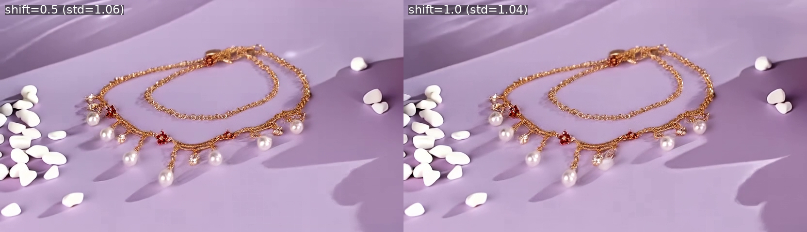
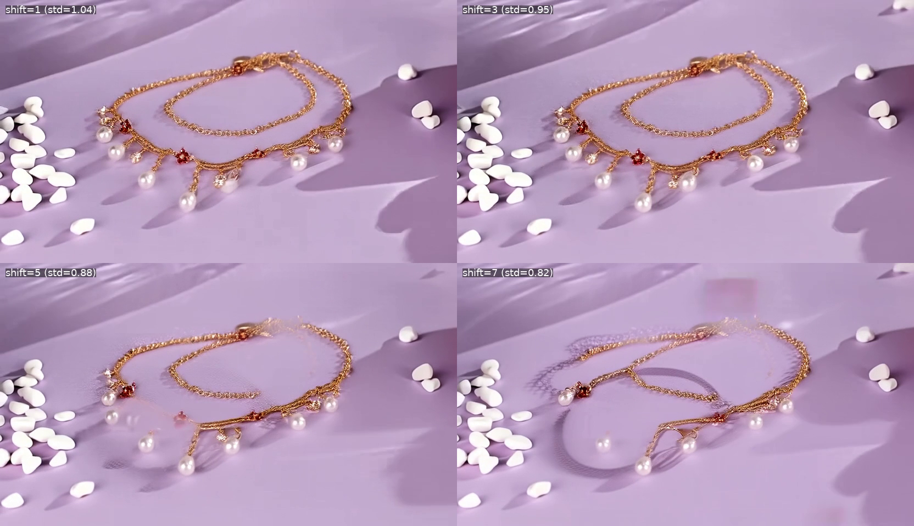
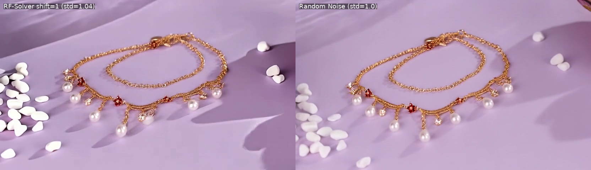

# RF-Solver Shift 参数消融实验

**日期**: 2026-01-20
**主题**: shift 参数对 Inversion 质量的影响
**测试用例**: bracelet_to_necklace (832x480, 25帧)

---

## 实验背景

在 RF-Solver Inversion 中，`shift` 参数控制时间步的分布。较大的 shift 会使时间步集中在高噪声区域，较小的 shift 使时间步分布更均匀。

**假设**：shift 越小，低噪声区域的步数越多，inversion 越精确。

---

## 实验配置

| 参数 | 值 |
|------|-----|
| 方法 | RF-Solver (二阶) + TI2V 首帧条件 |
| steps | 50 |
| cfg | 5.0 |
| 分辨率 | 832x480 |
| 帧数 | 25 |

---

## 实验结果

| shift | Inverted std | 与 1.0 差距 | 后续帧质量 |
|-------|-------------|------------|-----------|
| 7.0 | 0.82 | -0.18 | 差，明显退化 |
| 5.0 | 0.88 | -0.12 | 一般，有退化 |
| 3.0 | 0.95 | -0.05 | 良好 |
| 1.0 | 1.04 | +0.04 | 很好 |
| **0.5** | **1.06** | +0.06 | **最佳** |
| 随机噪声 | 1.0 | 0 | 最佳（参考） |

### 结果截图

**shift=0.5 vs shift=1.0** (最佳对比):



**4-way 对比** (shift=1, 3, 5, 7):



**shift=1 vs 随机噪声**:



---

## 核心发现

### 1. shift 越小，inversion 越精确

```
shift=7    →  std=0.82  (差)
shift=5    →  std=0.88  (一般)
shift=3    →  std=0.95  (良好)
shift=1    →  std=1.04  (很好)
shift=0.5  →  std=1.06  (最佳)
```

### 2. 原因分析

shift 参数影响时间步的分布：
- **shift 大**：时间步集中在高噪声区域，低噪声区域步数少，精度不足
- **shift 小**：时间步分布更均匀，低噪声区域步数多，精度高

```python
# shift 公式 (flow matching)
sigmas = shift * sigmas / (1 + (shift - 1) * sigmas)
```

### 3. shift < 1 更进一步优化

- shift=1 时，sigmas 不变，时间步完全均匀分布
- shift=0.5 时，时间步更集中在低噪声区域，进一步提高 inversion 精度
- 但 shift 过小可能导致高噪声区域步数不足，需要平衡

---

## 最佳配置

```bash
python scripts/ti2v_rfsolver.py \
    --shift 0.5 \    # 关键：使用 shift=0.5
    --steps 50 \
    --cfg 5.0 \
    ...
```

---

## 分离实验：Inversion 与 Denoising 用不同 shift

**假设**：Inversion 用小 shift (0.5) 保证精确反演，Denoising 用大 shift (5.0) 可能更符合 TI2V 训练时的设置。

### ~~错误实验（49帧）~~

> **注意**：以下结果因误用 49 帧而导致质量下降，仅作参考。

| Inversion shift | Denoising shift | Inverted std | 视觉质量 |
|-----------------|-----------------|--------------|---------|
| 0.5 | 0.5 | 1.0053 | 差 |
| 0.5 | 5.0 | 1.0053 | 差，项链持续变形 |

### 正确实验（25帧）

| Inversion shift | Denoising shift | Inverted std | 视觉质量 |
|-----------------|-----------------|--------------|---------|
| 0.5 | 0.5 | 1.0553 | 良好 |
| 0.5 | 1.0 | 1.0553 | 良好 |
| 0.5 | 5.0 | 1.0553 | 良好 |

**结论**：
- 使用正确的 25 帧配置后，三种 Denoising shift 结果**肉眼难以分辨**
- Inverted std 完全相同（因为 Inversion 参数一致）
- Denoising shift 对最终质量影响不大，可选用任意值
- **帧数对 inversion 质量影响显著**：49帧 → std≈1.005，25帧 → std≈1.055

---

## 结论

1. **shift=0.5 是最佳设置**，Inverted std=1.06，甚至略超标准高斯
2. **默认 shift=5.0 不是最优**，会导致 inversion 质量下降
3. **shift 参数对 inversion 质量影响显著**，应作为重要超参数调优
4. **shift=0.5 的效果已接近随机噪声**，说明 inversion 路径足够精确
5. **Denoising shift 对生成质量影响不大**，三种配置肉眼难以分辨
6. **帧数对 inversion 质量影响显著**，25帧优于49帧

---

## 相关文件

- 代码: `baseline/compositional-flux-ti2v/scripts/ti2v_rfsolver.py`
- 结果视频:
  - `experiments/results/compositional/ti2v_rfsolver_shift0.5.mp4`
  - `experiments/results/compositional/ti2v_rfsolver_shift1.mp4`
  - `experiments/results/compositional/ti2v_rfsolver_shift3.mp4`
  - `experiments/results/compositional/ti2v_rfsolver_shift7.mp4`
  - `experiments/results/compositional/ti2v_rfsolver_inv0.5_denoise5.mp4` (分离实验)
- 对比视频:
  - `experiments/results/compositional/comparison_shift_1_3_5_7.mp4`
  - `experiments/results/compositional/comparison_25f_denoise_shift.mp4` (分离实验 25帧)
