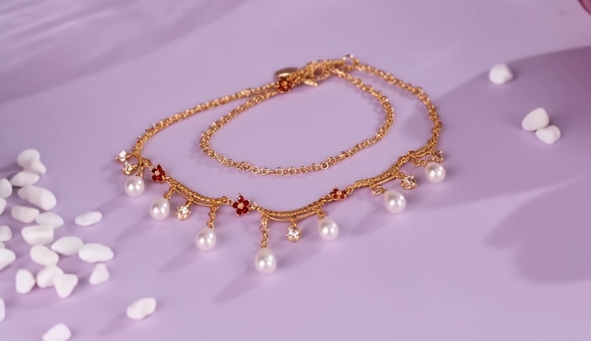

# RF-Solver TI2V Inversion 实验记录

**日期**: 2026-01-20
**主题**: RF-Solver 二阶 Inversion + TI2V 首帧条件
**测试用例**: bracelet_to_necklace (832x480, 25帧)

---

## 实验背景

基于 lizhiying 的技术报告，尝试在 RF-Solver Inversion 中加入 TI2V 首帧条件机制。

**lizhiying 方法核心思想**：
- Inversion 阶段：使用**源视频首帧**作为 TI2V 条件
- Generation 阶段：使用**目标首帧**作为 TI2V 条件

---

## 实验对比

### 方法配置

| 方法 | Inversion | TI2V 首帧条件 | 中点条件 |
|------|-----------|--------------|---------|
| 随机噪声 | ❌ 跳过 | N/A | N/A |
| RF-Solver 原始 | ✅ 二阶 | ❌ 无 | N/A |
| RF-Solver + lizhiying | ✅ 二阶 | ✅ 有 | ✅ 有 |
| **RF-Solver v2** | ✅ 二阶 | ✅ 有 | ❌ 无 |

### 实验结果

| 方法 | Inverted std | Frame 0 | Frame 12 | 整体评价 |
|------|-------------|---------|----------|---------|
| 随机噪声 | 1.0 | ✅ | ✅ 清晰一致 | **最佳** |
| RF-Solver 原始 | 0.82 | ✅ | ⚠️ 有退化 | 一般 |
| RF-Solver + 中点条件 | 0.78 | ✅ | ❌ 严重退化 | 差 |
| **RF-Solver v2** | **0.88** | ✅ | ⚠️ 良好 | **次优** |

### 关键截图

**RF-Solver v2 (最佳 Inversion 方法)**:

| Frame 0 | Frame 12 |
|---------|----------|
|  |  |

---

## 核心发现

### 1. 中点不应应用 TI2V 条件

**问题**：在 RF-Solver 的中点计算时应用 TI2V 首帧条件会干扰二阶导数估计。

```python
# ❌ 错误做法
z_mid = z + v * (dt/2)
z_mid_input = (1-mask) * z_source_first + mask * z_mid  # 干扰导数估计
v_mid = model(z_mid_input, t_mid)

# ✅ 正确做法
z_mid = z + v * (dt/2)
v_mid = model(z_mid, t_mid)  # 直接使用 z_mid，不加条件
```

**原因**：中点只用于估计 dv/dt，不是实际的 latent 状态，强制应用首帧条件会破坏导数的物理意义。

### 2. TI2V 首帧条件在当前位置是有效的

在当前位置应用 TI2V 条件可以让模型"知道"视频的首帧内容，有助于正确编码运动信息。

```python
# 当前位置应用 TI2V 条件
latent_input = (1-mask) * z_source_first + mask * zT
v = model(latent_input, t)
```

### 3. 随机噪声仍是最简单有效的方案

对于我们的测试用例，随机噪声的效果最好。这说明：
- TI2V 模型本身已足够强大，能从首帧推断后续帧
- Inversion 得到的噪声可能仍包含源视频残留，与目标首帧冲突

---

## 最终代码

**关键修改** (`ti2v_rfsolver.py`):

```python
# Inversion 循环
for i in range(len(sigmas_inv) - 1):
    t_curr, t_next = sigmas_inv[i], sigmas_inv[i + 1]
    dt = t_next - t_curr

    # 当前位置：应用 TI2V 首帧条件
    latent_input = (1 - mask2) * z_source_first + mask2 * zT
    v = model(latent_input, t_curr)

    # 中点：不应用 TI2V 条件
    z_mid = zT + v * (dt / 2)
    v_mid = model(z_mid, t_mid)  # 直接用 z_mid

    # 二阶更新
    dv_dt = 2 * (v_mid - v) / dt
    zT = zT + v * dt + 0.5 * dt² * dv_dt
```

---

## 运行命令

```bash
# RF-Solver v2 (推荐)
CASE_DIR=~/pvtt/data/pvtt-benchmark/cases/bracelet_to_necklace
python scripts/ti2v_rfsolver.py \
    --checkpoint-dir /data/xuhao/Wan2.2/Wan2.2-TI2V-5B \
    --source-video $CASE_DIR/source_video.mp4 \
    --source-prompt "A black leather bracelet and silver chain bracelet on purple silk fabric, elegant jewelry display, soft lighting" \
    --target-prompt "A gold chain necklace with white pearl pendants on purple silk fabric, elegant jewelry display, soft lighting" \
    --target-frame $CASE_DIR/target_frame1.png \
    --output ./results/ti2v_rfsolver_v2.mp4 \
    --width 832 --height 480 \
    --steps 50 --cfg 5.0 --shift 5.0 --max-frames 25

# 随机噪声 (最简单)
python scripts/ti2v_rfsolver.py \
    --skip-inversion \
    ... (同上)
```

---

## 结论

1. **随机噪声**：最简单、效果最好，适合不需要保留源视频运动的场景
2. **RF-Solver v2**：Inverted std=0.88，效果次优，适合需要保留源视频运动的场景
3. **中点不加条件**：RF-Solver 的中点只用于导数估计，不应强制应用 TI2V 条件

---

## 相关文件

- 代码: `baseline/compositional-flux-ti2v/scripts/ti2v_rfsolver.py`
- 结果视频: `baseline/compositional-flux-ti2v/results/ti2v_rfsolver_v2.mp4`
- 测试数据: `data/pvtt-benchmark/cases/bracelet_to_necklace/`
- 参考: lizhiying 的 `docs/technical_report.md`
